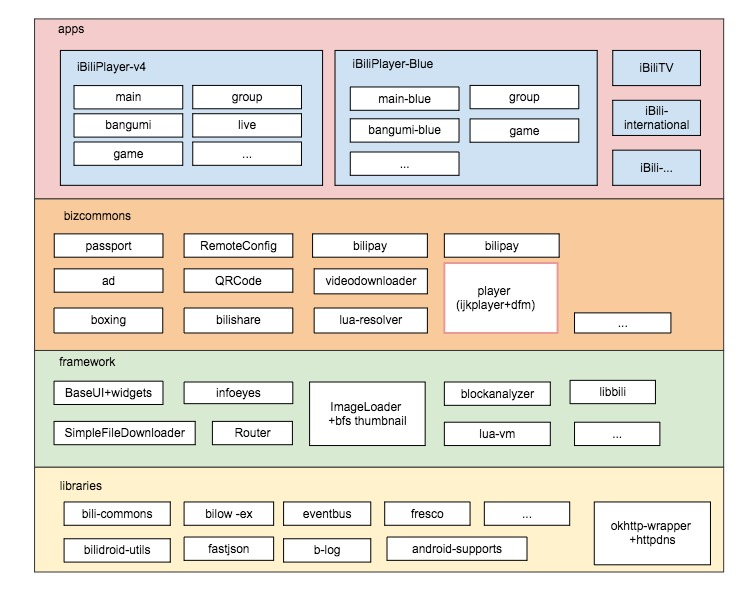
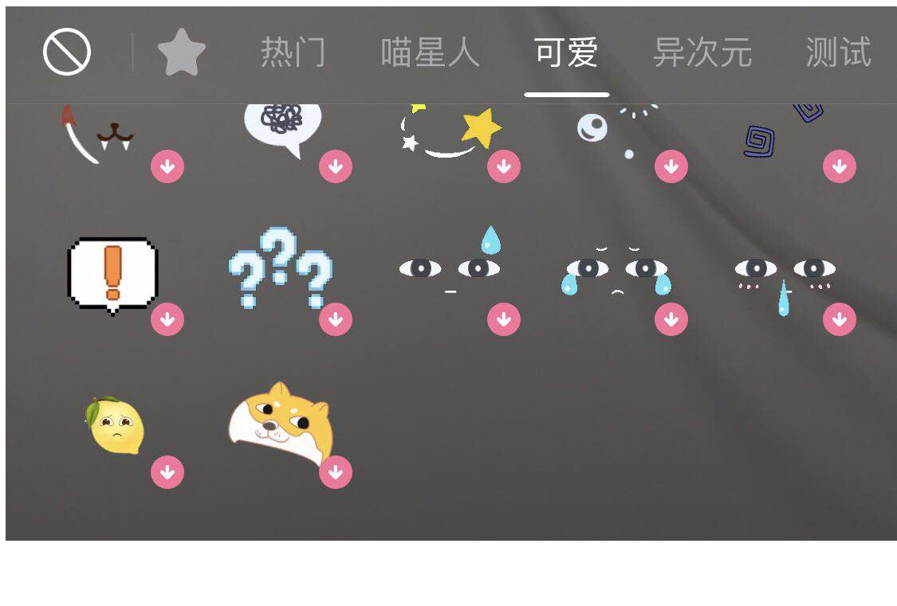
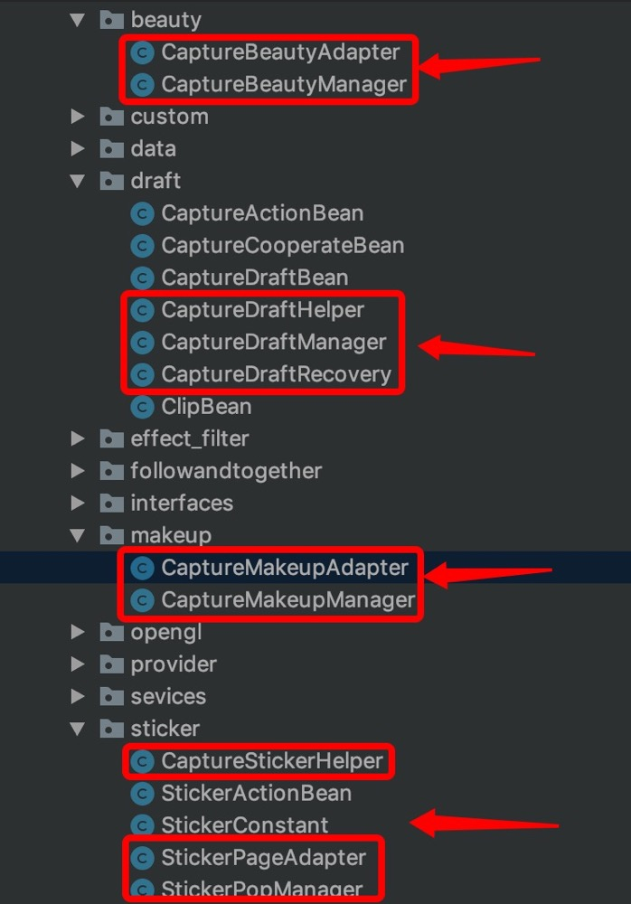

# Capture模块设计文档

[TOC]

## 1.Capture介绍

拍摄是编辑器下的一个子功能，通过摄像头取流，结合动效和BGM，生成用户期望的视频。该功能最初用于B端的投稿模块，UP主可以通过投稿入口拍摄并上传内容。随着版本的迭代，也会将拍摄功能提供给其它业务部门使用。

### 1.1.所属模块

Android大仓总共分为四个层级，如下图所示（参考链接：https://info.bilibili.co/display/mt/Android+project+architecture）：



- apps：业务层。
- bizcommons：通用业务层，包含业务相关的通用功能，供apps层各模块使用。
- framework：框架层，包含基础UI组件、路由、文件下载器、阻塞分析、缩略图下载等业务无关的框架。
- libraries：基础类库层，包含通用工具、log、json、http等基础类库。

上述分层遵循拔插式的设计原则，对于一个新的业务模块而言，可以依赖bizcommons、framework、libraries中的基础模块进行开发，降低开发成本，减少重复代码。

原则上上层模块可以依赖下层模块，但是同个层级的模块之间禁止相互依赖，减少模块耦合。

目前B端技术中心的移动开发组主要负责apps的upper模块以及bizcommons中的editor模块，而拍摄则属于editor中的一个子功能。

### 1.2.需求概述

拍摄模块需要实现以下功能（FIXME）：

- 基础功能：取流、变速、闪光灯、倒计时、翻转摄像头。
- 美化：滤镜、美颜、美妆
- 特效
- 音乐
- 合拍

## 2.Capture对外交互

### 2.1.Capture入口

目前可以通过两种方式跳转至拍摄界面：

- 依赖comm层的editor模块，直接访问CaptureFragment，跳转到拍摄界面。
- 不依赖editor，通过外链（Router）的方式跳转至拍摄界面。

第一种方式有两种使用场景：

- 部门内部的upper模块依赖并使用Capture功能（VideoPickerActivity）。
- 其它业务部门依赖并使用Capture功能（TODO）。

活动H5页面通常会使用第二种方式来调用Capture。

#### 2.1.1.Router通信方式

关于Router的详细介绍可以查看INFO中的相关资料：

https://info.bilibili.co/display/mt/Android+Router

跳转到拍摄界面（VideoPickerActivity）的代码示例如下：

```java
Router.global()
   .with("JUMP_PARAMS", ssss.replaceAll("amp;", ""))
   .with(ActionWebviewActivity.this)
   .add(Intent.FLAG_ACTIVITY_SINGLE_TOP)
   .add(Intent.FLAG_ACTIVITY_CLEAR_TOP)
   .open("activity://uper/video-picker/");
```

### 2.2.Capture出口

从拍摄界面可以去如下几个界面：

- 返回上级界面。
- 进入活动界面。
- 拍摄完成后，进入编辑界面。
- 进入音乐列表界面。
- 进入合拍界面。
- 从CaptureFragment切换至VideoPickerFragment。

当拍摄完成后，将CaptureTask中的信息传递给编辑界面即可。

## 3.Capture内部设计

### 3.1.UI层级概述

在Upper模块中，VideoPickerActivity包含VideoPickerFragment（相册）和CaptureFragment（拍照）两个界面。VideoPickerActivity中的UI元素如下：

```xml
-TintRelativeLayout
--TintRelativeLayout (title)
---ImageView (back)
---TextView (title)
---TextView (next)
---TextView (draft)
--NoScrollViewPager (container)
--TintFrameLayout (TODO)
--BottomBar
```

其中NoScrollViewPager用于放置CaptureFramgent。CaptureFrament的UI元素如下：

```
-RelativeLayout
--RelativeLayout (media)
--RelativeLayout (live_window)
--RelativeLayout (follow_layout)
--RelativeLayout (video_effect)
--RelativeLayout (camera_controll)
--LinearLayout (delete_confirm_bar)
--LinearLayout (TODO)
--RelativeLayout (record)
TODO...
```

### 3.2.内部模块组织概述

使用Code Iris插件生成整个editor模块的Package层级示意图如下所示：


其中capture包含的package和Class如下所示：

- Controller相关Class：BaseCaptureFragment、CaptureFragment
- 按照业务划分，有如下package：beauty（美颜）、draft（草稿）、followandtogether（合拍）、makeup（美妆）、sticker（贴纸）
- 按照用途划分，有如下package：custom（自定义View）、data、interface、opengl、utils、provider
- 其它package：effect_filter、services 、web（CaptureSchema）
- 其它Class：CaptureModel、CaptureSharedPreference、CaptureVideoEditCustiomize、CaptureLayoutHelper、CaptureFragmentHelper、ARFaceParams、CaptureConstants

### 3.3.美摄Context

拍摄相关功能均依赖于美摄SDK，核心就是上下文对象：NvsStreamingContext。

NvsStreamingContext定义了两种类型的接口：

- insertXXX：向指定层级插入特效。
- appendXXX：新增一个层级的特效。

目前的设计中，总共有三种层级的效果，其中第0层是人脸，第1层是滤镜，第2层是贴纸（看来源）。

调用`StreamingContext`的`removeCaptureVideoFx`方法可以移除某个层级的特效，后续层级将依次往前一位(类似于链表的数据结构)。

### 3.4.第三方依赖

1.2章节列举了特效（贴纸）和美化（滤镜、美颜、美妆）两种功能。来自商汤、美摄和自制三种途径。下面列举所有功能各自的途径和层级：

- 特效(贴纸)
  - 分屏：自制，位于层级2。
  - 其它：商汤，位于层级0（`Face Effect2`）。
- 滤镜
  - 占位滤镜：自制，位于层级1。
  - 粒子效果：美摄，位于层级1。
  - 卡通：美摄，位于层级1。
  - LUT：美摄，位于层级1。
- 美颜：商汤，位于层级0（`Face Effect2`）。
- 美妆：商汤，位于层级0（`Face Effect2`）。

### 3.5.基础功能

#### 3.5.1.采集预览

采集预览依赖于美摄SDK，美摄SDK通过摄像头取流后将数据渲染到UI上。对于外部使用来说，调用分为两个步骤：

1. 将用于渲染的View送给美摄SDK进行绑定（BaseCaptureFragment的attachLiveWindow接口）。

   ```java
   nvsStreamingContext.connectCapturePreviewWithLiveWindow(liveWindow)
   ```

2. 开启预览（BaseCaptureFragment的startCapturePreview接口）。

   ```java
   nvsStreamingContext.startCapturePreview(CaptureProvider.getCaptureProvider().getNowDeviceIndex(), mCaptureResolutionGrade, flags, null)
   ```

   预览相关flag：

   - NvsStreamingContext.STREAMING_ENGINE_CAPTURE_FLAG_CAPTURE_BUDDY_HOST_VIDEO_FRAME  // 当开启大眼/瘦脸/道具时必须添加此Flag
   - NvsStreamingContext.STREAMING_ENGINE_CAPTURE_FLAG_DONT_USE_SYSTEM_RECORDER  // 不使用系统录制
   - NvsStreamingContext.STREAMING_ENGINE_CAPTURE_FLAG_LOW_PIPELINE_SIZE // 视频质量不高时添加此Flag

#### 3.5.2.录像

点击拍摄按钮后调用美摄SDK进行录像，数据存放到指定路径的文件中（BaseCaptureFragment的startRecord接口）。

```java
nvsStreamingContext.startRecording(currentClipFilePath, flag)
```

录像相关flag：

- NvsStreamingContext.STREAMING_ENGINE_RECORDING_FLAG_IGNORE_VIDEO_ROTATION
- NvsStreamingContext.STREAMING_ENGINE_CAPTURE_FLAG_DONT_CAPTURE_AUDIO

#### 3.5.3.变速

变速的整体流程如下：

1. 在预览阶段选择变速后，将`speed`信息存储到`CaptureProducer`。
2. 以正常速度进行录像，**录像实际时长=拍摄时长/倍速**。在`onRecordDurationChanged`回调中更新UI时，需要通过`speed`将拍摄时长换算成录像实际时长。
3. 录像结束后（`onRecordStopped`），将`speed`信息存储到`VideoClipRecordInfo`的片段列表（`List<VideoClip>`）中。
4. 确认使用录像后（`onCaptureFinished`），将`VideoClipRecordInfo`存入`CaptureTask`并传递给编辑模块。
5. 在编辑模块中预览视频时，将变速信息传递给美摄SDK，SDK内部会根据变速信息对视频进行换算PTS或者丢帧的操作。

#### 3.5.4.翻转摄像头

翻转摄像头后，更新`CaptureProducer`中的`nowDeviceIndex`信息，并重新调用`startCapturePreview`接口开启预览。

#### 3.5.5.闪光灯

使用前置摄像头时禁用闪光灯；使用后置摄像头时启用闪光灯。

调用美摄SDK的接口切换手机闪光灯的状态（`clickOnFlash`）：

```java
nvsStreamingContext.toggleFlash(!nvsStreamingContext.isFlashOn());
```

切换闪光灯后还需要进行数据埋点统计：

```
ContributeRepoterCapture.contributeCaptureFlashSwitchClick(from, flashId);
```

#### 3.5.6.倒计时

预览阶段，选择倒计时后（`onCaptureMoreActionItemClick`）使用`mCountDownIndex`记录相关信息。

点击录像时，通过`mCountDownIndex`和`Handler`模拟倒计时效果（`countDownRunnable`）。

### 3.6.特效(贴纸)

#### 3.6.1.UI结构

UI效果图如下所示：



- TabBar使用水平滑动的RecyclerView。
- 贴纸布局使用水平滑动的ViewPager。在ViewPager的每个Item中嵌套垂直滑动的RecyclerView，用于显示贴纸列表。
- 给ViewPager添加滑动监听，当回调`onPageSelected`时联动更新上方Tab的选中位置。

#### 3.6.2.数据结构

- 封装`StickerPopManager`，用于管理TabBar和ViewPager的布局和贴纸数据。
- StickerTabAdapter用于存储所有贴纸数据，并和TabBar的RecyclerView进行绑定。
- StickerTabAdapter中存储了StickAdapter列表，StickerAdapter用于存储某种类型的贴纸数据，并与ViewPager单个Item中的RecyclerView进行绑定。

#### 3.6.3.特效使用流程

当用户点击选中某个特效时，会执行StickerAdapter的`onSelect`回调，在其中执行StickerTabAdapter的`onItemClickListener`回调，最终会执行如下方法：

```java
CaptureStickerHelper.applyStickerFx(getContext(), nvsStreamingContext, mStickerTabAdapter, mARFaceFx, mStickerIvIcon, mCaptureTvSticker);
```

`applyStickerFx`方法中包含了两种情况：

- 实现自定义的分屏特效：

  - 构造`NvsCustomVideoFx.Renderer`对象(`SplitScreenFilter`)，传入贴纸路径。

  - 将构造好的Renderer传递给StreamingContext：

    ```
    streamingContext.insertCustomCaptureVideoFx(splitScreenFilter, STICKER_FILTER_LIST_INDEX);
    ```

- 显示美摄SDK自带滤镜，在StickerContext中传入贴纸路径：

  ```java
  stickerCtx.setStringVal("Sticker Mode", adapter.getSelectedItem().stickerInfo.sticker_path);
  ```

若选中的特效未曾下载，则执行StickerAdapter的`onDownload`回调走下载流程，等下载成功后再显示特效。

NvsCustomVideoFx.Renderer的内部原理请查看相关文档(TODO)。

### 3.7.美化

美化分成三个部分：滤镜、美颜、美妆。

使用`BeautyPopupWindow`管理美化功能的UI。

点击美化按钮后执行`CaptureFragment`的`clickOnBeautify`接口。

#### 3.7.1.滤镜

在`clickOnBeautify`接口中初始化`BeautyPopupWindow`窗口、滤镜相关的RecyclerView和SeekBar（待优化）。

`FilterAdapter`中定义了选择滤镜的`onSelected`回调，在该回调中调用了`FilterHelper`的`applyFilterFx`接口。

`FilterHelper`用于实现滤镜相关的操作，滤镜分为三种类型：`Package`（直接导入zip实现，包括花瓣等粒子效果，类似于贴图）、`Carton`（包括卡通、漫画等）、`LUT`（包括小清新、日系等）。

在3.3章节提到过滤镜位于第2层，每次执行`applyFilter`时会先移除第2层的特效，再将新选择的滤镜(或者是占位滤镜)插入到第2层，代码如下：

```java
streamingContext.removeCaptureVideoFx(STICKER_FILTER_LIST_INDEX);
PlaceHolderFilter filter = new PlaceHolderFilter(context);	// 占位滤镜
nvsStreamingContext.insertCustomCaptureVideoFx(filter, FILTER_LIST_INDEX);
```

添加三种类型滤镜的接口如下所示：

```java
// Package
NvsCaptureVideoFx videoFx = nvsStreamingContext.insertPackagedCaptureVideoFx(item.getFilterInfo().filter_id, FILTER_LIST_INDEX);
// Carton
NvsCaptureVideoFx videoFx = nvsStreamingContext.insertBuiltinCaptureVideoFx(FilterInfo.FILTER_ID_CARTOON, FILTER_LIST_INDEX);
// LUT
NvsCaptureVideoFx videoFx = nvsStreamingContext.insertBuiltinCaptureVideoFx(VideoUtil.LUT_FILTER, FILTER_LIST_INDEX);
// 可以通过返回的NvsCaptureVideoFx对象设置滤镜强度
videoFx.setFilterIntensity(item.getFilterInfo().filter_intensity);
```

#### 3.7.2.美颜

`CaptureBeautyManager`用于管理美颜相关数据，数据类型是`CaptureBeautyEntity`，包含了名称、属性、图标、是否选中、最大值、当前值、默认值等信息。其中当前值存储在本地数据库中，通过`params`参数进行获取：

```java
EditorXpref.getSharedPreferences(context).getFloat(params, defaultValue);
```

`CaptureBeautyAdapter`用于绑定数据和RecyclerView，在Adapter的构造方法中，会通过`CaptureBeautyManager`获取美颜数据。

在`BeautyPopupWindow`的`initBeauty`方法中初始化RecyclerView和Adapter，美颜功能的核心实现位于列表的`OnSeekBarChangeListener`回调。滑动进度条时，实时更新内存和数据库的数据（待优化），同时将数值设置给`NvsCaptureVideoFx`：

```java
aRFaceFx.setFloatVal(captureBeautyEntity.params, captureBeautyEntity.currentValue);
```

在`CaptureFramgent`的`onCreate`中通过`StreamingContext`初始化`NvsCaptureVideoFx`，这就是3.3章节提到的人脸效果，位于第0层，需要确保该效果优先于滤镜和贴纸添加：

```java
mARFaceFx = nvsStreamingContext.appendBuiltinCaptureVideoFx("Face Effect2");
```

#### 3.7.3.美妆

`CaptureModel`用于请求美妆的网络数据，数据类型是`EditorMaterialEntity`，其中存储了美妆实体类`ArrayList<CaptureMakeupEntity>`。

在`BeautyPopupWindow`的`initMakeUp`接口中将美妆数据传递给`CaptureMakeUpManager`和`CaptureMakeupAdapter`。

`CaptureMakeUpManager`用于管理美妆相关数据，数据类型是`CaptureMakeupEntity`，包含了id、名称、封面、下载地址、美妆路径等信息。

在`CaptureMakeupAdapter`的`itemSelected`回调中实现了美妆的最终效果，和美颜一样，该效果位于第0层：

```java
aRFaceFx.setStringVal(ARFaceParams.STICKER_MODE, captureMakeupEntity.makeupPath);
```

### 3.8.合拍

TODO

### 3.9.BGM

TODO

## 4.已知问题

### 4.1.Package划分问题

**问题描述**

正如3.2章节所示，capture中包的划分不够合理，同时使用业务和类型两个维度分包，并且部分class没有划分到合适的包中。

**解决思路**

对于一个较大的模块，可以优先**根据业务**划分，并定义一个通用包common，用于存放多个业务公用的class。

在每个业务当中，再**根据类型**进行划分，比如entity、component、model等。

考虑到capture本身只是videoeditor模块中的一个子功能，内容较少，不需要再细分其中的业务(比如美化、特效等)，因此直接**根据类型**进行分包。

可以看到当前每个业务包下的class很少，没有这样划分的必要（红框内为有效class，不计算bean类）：



重构后的包结构将会如下所示：

- **utils**：

  CaptureRotateManager、ContributeRepoterCapture、FileUtil、StickerApplyedChecker、Utils、CoordinateUtils、OpenGlUtils、CaptureFragmentHelper、CaptureLayoutHelper

- **interface**：

  BeautyPopType、IOnCaptureStatusCallback、OnActivityCancelListener、OnHasCapturesListener、OnLiveWindowTouchListener、OnScreenRotateListener

- **entity**：

  BGMInfo、BgmMissionInfo、CameraCoo、CaptureBeautyEntity、CaptureCategoryFilterBean、CaptureCategoryStickerBean、CaptureControl、CaptureFilterBean、CaptureInfo、CaptureIntroBean、CaptureLatestBean、CaptureMakeupEntity、CaptureStickerBean、CaptureUsageInfo、ModuleShow、MusicDetailsEntry、VideoClipRecordInfo、CaptureActionBean、CaptureCooperateBean、CaptureDraftBean、ClipBean、FtMaterialAidCidBean、FtVideoUrlInfoBean、CapturePreResult、StickerActionBean、StickerTabBean

- **constant**：

  StickerConstant、ContributeConstant、ARFaceParams、CaptureConstants

- **model**（数据存储和管理相关，将provider也归并至model中）：

  CaptureBeautyManager、CaptureDraftHelper、CaptureDraftManager、CaptureDraftRecovery、FtDataFetcher、CaptureMakeupManager、CaptureStickerHelper、StickerPopManager、CaptureModel、CaptureSharedPreferences、CaptureProvider

- **remote**（网络相关，远程交互）：

  CapturePreService、GetMusicFromNet、GetMusicInfoApiService、CaptureSchema

- **adapter**：

  CaptureBeautyAdapter、CaptureMakeupAdapter、StickerPageAdapter、StickerTabAdapter

- **component**（组件，结合了view和model）：

  FtCaptureComponent(内部封装了MediaPlayer，名字可以优化）

- **widget**（组件，纯view）：

  BeautyPopupWindow、CaptureCameraMorePopupWindow、CaptureFocusExposureView、CaptureLiveWindow、FTPlayView、RecordButton、ScrollTextView、UniversalPopWindow、VerticalSeekBar、FtLoadingPopupWindow

- **renderer**：

  PlaceHolderFilter、SplitScreenFilter、FtCombinationRender

- **ui**（结合了view和controller）：

  BaseCaptureFragment、CaptureFragment、CaptureVideoEditCustomize(该类用于控制流程，命名不明确，待优化)

重构包结构后再对部分不合理的class命名进行更新，在此不再赘述。

### 4.2.贴纸UI问题

**问题描述**

从3.6.1章节可以看到，贴纸的TabBar使用了RecycerView，实现不够优雅。并且存在两个问题：

- ViewPager和TabBar的联动效果与IOS不一致：IOS在ViewPager滑动过程中实时滑动TabBar，而Android则是在ViewPager滑动结束后再滑动TabBar。
- 联动时无法确保TabBar选中的Tab位于中间。

**解决思路**

使用TabLayout代替RecyclerView来实现TabBar布局，代码可以更加优雅，并且TabLayout内部实现了与ViewPager的相关联动，使用非常方便。

### 4.3.美化UI问题

**问题描述**

点击美化按钮时会执行`clickOnBeautify`接口，美颜和美妆界面的初始化代码均封装在`UniversalPopWindow`中，而滤镜的初始化代码却未做封装，两者实现不一致。其次是对于美化界面的SeekBar来说，在拖动进度条的过程会实时去更新本地`SharedPreferences`的数据，该操作可能会比较损耗性能。

**解决思路**

- 统一滤镜、美颜和美妆的初始化代码
- SeekBar拖动结束时才更新`SharedPreferences`的数据。

### 4.4.CaptureTask数据冗余

CaptureTask内部数据结构：

- CaptureUsageInfo
- VideoClipRecordInfo
  - List\<VideoClip\>
    - CaptureUsageInfo

最外层和第三层均定义了CaptureUsageInfo数据类，造成数据冗余。建议取消最外层的CaptureUsageInfo对象。

### 4.5.PopupWindow内存问题

每点击一次拍摄界面的按钮（比如贴纸、美化），均会新建一个PopupWindow，造成较大的内存开销。建议后续将所有该界面的PopupWindow都改成可复用的模式。

### 4.6.重度依赖美摄SDK

**问题描述**

目前所有拍摄相关的功能均依赖于美摄SDK，从取流到渲染均不是我们自己处理的，这么做不利于项目后续的迭代。

**解决思路**

拆分美摄/商汤的功能，由B站自己处理除了人脸识别之外的其它功能，包括但不限于如下流程：

使用摄像头取流

1. 如果是YUV数据，直接将数据送给商汤/美摄SDK，获取输出数据后做如下操作：
   1. 如果是预览操作，使用OpenGLES渲染在UI上。
   2. 如果是录像操作，依次进行Encode、Mux、Dataout（输出到本地文件）。
2. 如果TS或者MP4编码格式的视频流：
   1. 依次进行Demux，Decode，生成YUV数据后，送给商汤SDK，后续操作同上处理。

整个框架(编解码+渲染)可以参考ijkplayer，或者直接让其提供接口支持，再集成商汤SDK，实现第一步目标。

第二步则是由自己实现所有滤镜效果，弃用美摄SDK。

后续再视情况成立自己的图像算法组，自己实现贴纸、美颜等效果，弃用商汤SDK。


