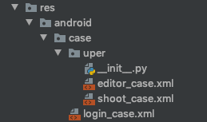
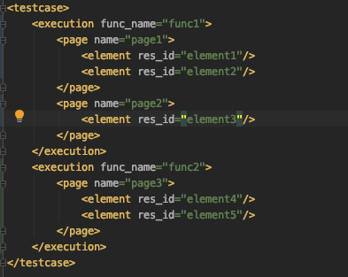

# Pikachu使用说明

| 版本/状态 | 责任人 | 起止日期   | 备注                                              |
| --------- | ------ | ---------- | ------------------------------------------------- |
| V1.0/草稿 | 蔡政和 | 2019/08/30 | 创建文档                                          |
| V1.1/草稿 | 蔡政和 | 2019/09/09 | 1.TestCase添加reset属性；2.by属性添加MobileBy选项 |


## 一、XML配置

Pikachu提供了四种xml配置文件：setup、page、case、autoprocessor，位于`/res/{{platform}}`目录下（{{platform}}表示双端各自的平台）。默认情况下，所有属性类型均为字符串。

### 1.1.setup

setup.xml中记录了用于建立Server和Client会话的基础参数，比如设备序列号，平台版本等。字段如下：

| 属性名            | 说明  | 说明                                                         |
| ----------------- | ----- | ------------------------------------------------------------ |
| platform_version  | true  | 客户端系统版本，如Android9的系统就填写"9"                    |
| device_name       | true  | 设备序列号，用于告知Server与哪台终端建立连接。对于Android用户，可以在Terminal中使用adb命令查看设备序列号：adb devices |
| app_wait_activity | false | 表示启动App后等待的界面，默认是启动页。对于Android用户，由于启动页(SplashActivity)显示后会立即跳转，Appium无法监听到等待界面，就会报错。因此需要手动将该属性设置为首页（MainActivityV2） |
| no_reset          | false | 表示每次启动用例时是否重置会话                               |
| unicode_keyboard  | false | 对于Android用户，在文本编辑框输入文字时可能会显示中文，导致输入异常。因此需要将unicode_keyboard和reset_keyboard两项同时设置为true，效果是隐藏输入法并将其设置为英文。 |
| reset_keyboard    | false | 同上                                                         |

### 1.2.page

page中定义了测试用例需要使用的元素。对应UI上的每个界面都需要声明一个xxx_page.xml文件。element标签的属性如下：

| 属性名  | 必选  | 说明                                                         |
| ------- | ----- | ------------------------------------------------------------ |
| res_id  | true  | 自定义的元素唯一标识，后续会在case中使用该标识，简化/风格统一化元素的id/xpath。 |
| by      | true  | 通过什么途径查找UI上的元素，常用值有: id，xpath              |
| value   | true  | 如果by属性是id，则此处填写元素在UI上的id；如果by属性是xpath，则此处填写元素在UI上的路径。id/xpath的查看方式请参考附录。 |
| index   | false | 若通过上述by/value方式定位到的元素有多个，则需要使用该字段指定具体是哪个元素。 |
| wait    | false | 默认值为"clickable"，表示只有当元素可点击时才会返回元素并执行对应的操作。有如下几个选项："none"，不关心元素状态，立即获取并执行；"exist"，当元素存在后才执行；"visible"，当元素可见后才执行。推荐使用默认值。 |
| timeout | false | 表示获取元素的超时时间，默认是20s。                          |

by属性可填写如下选项：

| by可选值             | 说明                                           |
| -------------------- | ---------------------------------------------- |
| id                   | 通过resource-id定位元素                        |
| xpath                | 通过绘制路径定位元素                           |
| link text            | 略                                             |
| patial link text     | 略                                             |
| name                 | 通过内容进行定位元素（仅限IOS使用）            |
| tag name             | 略                                             |
| class name           | 通过类名定位元素                               |
| css selector         | 略                                             |
| ios_predicate        | 略                                             |
| ios_uiautomation     | 略                                             |
| ios_class_chain      | 略                                             |
| andorid_uiautomator  | 通过UiSelector语法定位元素，支持内容的模糊匹配 |
| android_viewtag      | 略                                             |
| android_data_matcher | 略                                             |
| accessibility_id     | 略                                             |
| image                | 略                                             |
| custom               | 略                                             |


### 1.3.case

case中定义了测试用例的具体执行步骤。在case目录下，每个业务方需要新建一个业务目录，例如"uper"。原则上一个模块对应于一个case/xml，比如uper业务可以划分三个模块：拍摄、编辑器、创作中心，因此在uper目录下定义三个xml文件：editor_case.xml，shoot_case.xml，uper_case.xml。

#### 1.3.1.目录结构

其中通用/基础case可以直接放在case目录下：



#### 1.3.2.case构成

一个xml对应于一个模块的case，每个case中可以包含多个函数。一个函数代表一条测试用例，每个用例中可能使用到多个页面的元素。case构成如下：



case属性如下：

| 属性名     | 必选  | 说明                                                      |
| ---------- | ----- | --------------------------------------------------------- |
| preprocess | false | 预处理操作，比如login，在运行该用例之前会先执行登录流程。 |
| reset      | false | 是否清空应用数据。                                        |


#### 1.3.3.execution属性

| 属性名    | 必选 | 说明                                  |
| --------- | ---- | ------------------------------------- |
| func_name | true | 标识函数的名称，要求必须以"test_"开头 |

#### 1.3.4.page属性

| 属性名 | 必选 | 说明                                                     |
| ------ | ---- | -------------------------------------------------------- |
| name   | true | 页面对应的包名＋文件名，例如：res.android.page.main_page |

#### 1.3.5.element属性

| 属性名    | 必选  | 说明                                                         |
| --------- | ----- | ------------------------------------------------------------ |
| res_id    | true  | 元素唯一标识，需要和page中res_id一致。如果元素是整个窗口，则赋值"window" |
| action    | true  | 手势动作。支持如下几个选项："click"：单击操作；"send_keys"：向文本编辑框中输入文字；"swipe"：滑动手势，当使用滑动手势时必须指明from、to、gravity，且res_id通常为"window"；"none"：不做任何动作，只是判断元素是否存在；"assert"：断言，若命中断言直接退出用例，否则可以继续执行。 |
| value     | false | 配合部分手势使用，如搭配"send_keys"，表示输入的内容；搭配"assert"，表示元素的内容等于value时退出用例（函数）。 |
| from      | false | 搭配"swipe"使用，表示滑动的起始位置。如果是横向滑动，可以填写："left"、"right"、"center"；如果是纵向滑动，可以填写："top"、"bottom"、"center"。 |
| to        | false | 搭配"swipe"使用，表示滑动的终止位置。如果是横向滑动，可以填写："left"、"right"、"center"；如果是纵向滑动，可以填写："top"、"bottom"、"center"。 |
| gravity   | false | 搭配"swipe"使用，表示垂直于滑动方向的位置。如果是横向滑动，可以填写："top"、"bottom"、"cneter"；如果是纵向滑动，可以填写："left"、"right"、"center"。 |
| delay     | false | 延时执行某操作。                                             |
| necessary | false | 是否必须执行某操作。若为true，操作失败时直接中断该用例（函数）并抛出异常；若为false，操作失败时会继续往下执行。 |
| snapshot  | false | 是否需要截图，默认是false。                                  |

### 1.4.autoprocessor

该配置文件用于配置在后台自动执行的用例，以解决如下需求：Android、IOS经常会弹出权限、通知等系统弹窗，需要启动一个子线程不断监听这些弹窗是否存在，若存在则自动点击。将需要监听的系统弹窗配置到autoprocessor中。element标签的属性如下：

| 属性名 | 必选 | 说明                                    |
| ------ | ---- | --------------------------------------- |
| by     | true | 查找元素的方式，可以选择"id"或者"xpath" |
| value  | true | "id"或"xpath"对应的内容                 |
| action | true | 对该元素进行的动作，通常为"click"       |


## 二、邮箱配置

Pikachu提供了邮箱相关的Json配置文件`.email_account`，位于`/res`目录下。该文件未部署上gitlab，需要每个使用者单独配置一次。配置文件格式如下：

```json
{
	"from_address" : "caizhenghe@bilibili.com",
	"pwd" : "XXXXX",
	"to_address" : [
	    "caizhenghe@bilibili.com",
	    "lile@bilibili.com"
	],
	"content": "PikaPika，炸酱面真好吃"
}
```

其中pwd表示邮箱授权密码，可以前往QQ企业邮箱，通过`设置->微信绑定->生成新密码`方式获取

## 三、使用流程

1. 配置setup、page、case、autoprocessor四类文件，通常setup和autoprocessor只需要配置一次。

2. 配置`/res/.email_account`文件

3. 在`/srcs/pikachu.py`中指定app或者apk路径。

4. 启动Appium Server。

   可以使用如下客户端启动，或者直接在命令行中输入：`appium -a 127.0.0.1 -p 4723 --session-override`

   

5. 点击`/srcs/pikachu.py`左侧的绿色三角形运行即可。