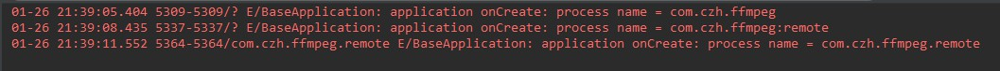
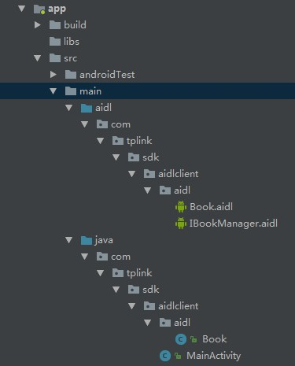

# Android IPC机制

| 版本/状态 | 责任人 | 起止日期   | 备注                    |
| --------- | ------ | ---------- | ----------------------- |
| V1.0/草稿 | 蔡政和 | 2019/01/26 | 创建Android IPC机制文档 |

[TOC]

## IPC简介

### 概念

IPC，全称是Inner-Process Communication，表示进程间通信或跨进程通信。首先我们先了解一下进程和线程的概念：

- 线程是CPU调度的最小单元。
- 进程是操作系统分配资源的最小单元。在PC或移动端，进程通常代表着一个执行中的程序或者APP实例，一个进程可以包含多个线程（在Linux中线程本质上是特殊的进程）。

再延伸一下，什么是计算机资源？经典的冯诺依曼结构把计算机系统抽象成CPU+存储器+IO，那么计算机资源无非两种：

- 计算资源
- 存储资源

在Android系统中，每个进程跑在各自的JVM实例上（JVM实例本质上也是一个进程），操作系统会为每个JVM实例分配一块独立的存储空间。因此**进程应该是系统分配存储资源的最小单元**。

IPC机制并非Android特有，任何一个操作系统都需要IPC机制：

- Windows：剪贴板、管道、邮槽等。
- Linux：命名管道、共享内存、信号量等。
- Android：Binder、AIDL、Messenger、Socket、ContentProvider、文件共享等。

### 应用场景

IPC机制通常都应用在多进程场景中。多进程的情况分为两种：

- 一个应用因为某些原因自身需要采用多进程模式来实现，原因可能有：
  - 有些模块由于特殊原因需要运行在单独的进程中（比如安防项目的APP更新模块）。
  - 加大一个应用可使用的内存（Android对单个应用所使用的最大内存做了限制，早期某些版本是16MB，不同设备有不同的大小）。
- 当前应用需要向其他应用获取数据。

## Android的多进程模式

### 开启多进程模式

只需要给四大组件指定android:process属性，就可以轻易的开启多进程。开启多进程的代码如下：

```xml
<activity android:name=".MainActivity">
    <intent-filter>
        <action android:name="android.intent.action.MAIN" />
        <category android:name="android.intent.category.LAUNCHER" />
    </intent-filter>
</activity>
<activity android:name=".SecondActivity"
    android:process=":remote">
</activity>
<activity android:name=".ThirdActivity"
    android:process="com.czh.ffmpeg.remote">
</activity>
```

MainActivity没有指定process参数，运行在默认进程中，它的进程名就是包名："com.czh.ffmpeg"

SecondActivity指定了进程的缩略名，完整进程名是："com.czh.ffmpeg:remote"

ThirdActivity指定了进程的完整名字："com.czh.ffmpeg.remote"

进程名以“：”开头的进程属于当前应用的私有进程，其它应用的组件不能和它跑在同一个进程；不以”：“开头的进程属于全局进程，其它应用通过ShareUID可以和它跑在同一个进程。

两个应用跑在同个进程的前提是拥有相同ShareUID和签名。只要ShareUID和签名相同，无论是否在同一进程，两个应用均可共享私有数据，比如data目录、组件信息等；如果ShareUID、签名和进程均相同，两个应用还可以共享内存数据。

### 多进程模式的运行机制

在第一章节已经提到，进程是系统分配存储资源的最小单元。多进程之间共享内存数据（比如static变量）注定是失败的。在不同的虚拟机中访问同一个类的对象，会产生不同的数据副本。一般来说，使用多进程会造成如下几方面的问题：

1. 静态成员和单例模式失效。
2. 线程同步机制失效。
3. SharedPreferences可靠性降低。
4. Application会多次创建。

前两个问题很好理解。第三个问题是因为SharedPreferences不支持两个进程同时执行写操作（因为底层是通过读写XML文件实现的）。第四个问题是由于当一个组件跑在新进程中时，系统要创建新的进程并且分配独立的虚拟机，这其实就是启动一个应用的过程，所以会创建新的Application。针对第四个问题的测试代码如下：

```java
public class BaseApplication extends android.app.Application {
    private static final String TAG = BaseApplication.class.getSimpleName();

    @Override
    public void onCreate() {
        super.onCreate();

        String processName = "";
        ActivityManager manager = (ActivityManager) getApplicationContext().getSystemService(Context.ACTIVITY_SERVICE);
        for (ActivityManager.RunningAppProcessInfo process: manager.getRunningAppProcesses()) {
            if(process.pid == Process.myPid())
            {
                processName = process.processName;
            }
        }

        Log.e(TAG, "application onCreate: process name = " + processName);
    }
}
```

运行结果如下所示：



虽然多进程有很多问题，但是在前面章节提到的场景中我们依然需要使用它。系统给我们提供了很多跨进程通信的方法，虽然不能直接共享内存，但我们还是可以通过跨进程通信进行数据交互。

## AIDL

AIDL是一种基于Binder的进程间通信的机制，本章节主要介绍AIDL的使用方法，在下一章节会结合AIDL具体分析Binder的上层原理。

### 客户端

创建代表客户端的工程AIDLClient，添加三个文件：Book.java（Bean）、Book.aidl（Bean的aidl映射）、IBookManager.aidl（逻辑业务相关的aidl文件）。文件结构如下所示：



1. Book.java实现了parcelable接口，源码如下所示：

   ```java
   /* 省略Parcelable相关接口。可以直接使用快捷键Alt+Instert生成 */
   public class Book implements Parcelable {
       public int bookId;
       public String bookName;
   }
   ```

2. 鼠标放到aidl目录，点击右键->New->AIDL File，新建IBookManager.aidl文件。系统会自动将aidl文件添加到main目录下对应的aidl路径。IBookManager.aidl源码如下：

   ```java
   // IBookManager.aidl
   package com.tplink.sdk.aidlclient.aidl;
   // 需要显式导入Book类
   import com.tplink.sdk.aidlclient.aidl.Book;
   
   // Declare any non-default types here with import statements
   interface IBookManager {
       void addBook(in Book book);
       List<Book> getBookList();
   }
   ```

3. 在aidl路径下添加Book.aidl文件，源码如下：

   ```java
   package com.tplink.sdk.aidlclient.aidl;
   
   parcelable Book;
   ```

准备好上述三个文件后，点击Build，系统会自动在build->generated->source->aidl->debug目录下生成IBookManager.java文件。该文件的结构图如下所示：


简单说明下上述结构：

- IBookManager：本身是interface，并且继承了IInterface接口。包含Stub内部类、addBook接口和getBookList接口。
- Stub：IBookManager的静态抽象内部类，继承IBinder，并且实现了IBookManager接口。包含了Proxy内部类，asInterface、asBinder、onTransact接口，DESCRIPTOR标识符，"TRANSACTION_"开头的三个静态变量。
  - DESCRIPTOR：Stub的唯一标识，由包名+类名组成。
  - asInterface(IBinder)：用于将服务端的IBinder接口转换成客户端的IBookManager接口。这种转换过程是区分进程的，如果客户端和服务端在同一个进程，则返回的是服务端的Stub对象本身，否则返回系统封装后的Stub.Proxy对象。
  - asBinder()：返回当前的Binder对象。
  - onTransact()：这个方法运行服务端的Binder线程池中，

### 服务端


## Binder

本章节主要描述Binder的使用方法和上层原理，不深入探讨底层细节。从代码角度看，Binder是Android的一个类，实现了IBinder接口；从IPC角度看，Binder是Android中跨进程通信的一种机制，Binder还可以理解为一种虚拟的物理设备，它的设备驱动是/dev/binder；从Android Framework角度看，Binder是ServiceManager连接各种Manager（ActivityManager、WindowManager等等）和相应ManagerService的桥梁；从Android应用层看，Binder是客户端和服务端进行通信的媒介，在bindService的时候，服务端会返回一个包含服务端业务调用的Binder对象，通过该对象，客户端可以获取服务端提供的服务（普通服务和AIDL服务）和数据。

Android开发中，Binder主要用在Service中，下面结合AIDL来看看Binder的上层原理。

1. 

   ```
   
   ```

   系统会根据IBookManager.aidl自动生成一个对应的Binder类（在gen目录下），源码如下：

   ```
   
   ```

   

## 

## Messenger

## ContentProvider

## Socket

## 选用合适的IPC机制