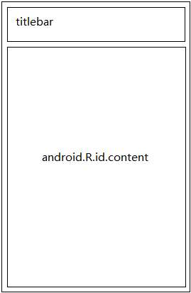

# View的工作原理

| 版本/状态   | 责任人  | 起止日期     | 备注              |
| ------- | ---- | -------- | --------------- |
| V1.0/草稿 | 蔡政和  | 2018/2/9 | 创建View的工作原理分享文档 |

[TOC]

## ViewRoot和DecorView

- DecorView是一个顶级布局，一般情况下它内部会包含一个竖直方向的LinearLayout，在这个LinearLayout里面有上下两个部分，上面是标题栏，下面是内容栏。在Activity中我们通过setContentView所设置的布局其实就是设置在内容栏中。内容栏的id是content。获取content和我们设置的布局的方法如下：

  ```java
  ViewGroup content = (ViewGroup)getWindow().getDecorview().findViewById(android.R.id.content);  // 内容栏
  View view = content.getChildAt(0);  // 我们设置的布局
  ```

  


- ViewRoot内部持有一个DecorView的对象，View绘制的三大流程均是通过ViewRoot来完成的。


> ViewRoot对应于ViewRootImpl类，它是连接WindowManager和DecorView的纽带。在ActivityThread中，当Activity被创建完毕后，会将DecorView添加到Window中，同时创建ViewRootImpl对象，并将ViewRootImpl对象和DecorView建立关系。

## MeasureSpec

> 从字面上看，MeasureSpec表示测量规格的意思。它参与了View的measure过程，并在很大程度上决定了一个View的尺寸规格。在测量过程当中，系统会将View的LayoutParams根据父容器所施加的规则转换为对应的MeasureSpec，然后再根据这个MeasureSpec来测量出View的宽/高。

### MeasureSpec的含义

MeasureSpec代表一个32位int值，高2位代表SpecMode（测量模式），低30位代表SpecSize（某种测量模式下的规格大小）。MeasureSpec内部的一些常量定义如下所示：

```java
private static final int MODE_SHIFT = 30;
private static final int MODE_MASK  = 0x3 << MODE_SHIFT;
// 父容器不对View有任何限制，要多大给多大，这种情况一般用于系统内部，表示一种测量的状态
public static final int UNSPECIFIED = 0 << MODE_SHIFT;
// 父容器已经检测出View所需要的精确大小，这个时候View的最终大小就是SpecSize所指定的值
public static final int EXACTLY     = 1 << MODE_SHIFT;
// 父容器指定了一个可用大小即SpecSize，View的大小不能大于这个值，具体是什么值看不同View的具体实现
public static final int AT_MOST     = 2 << MODE_SHIFT;
public static int makeMeasureSpec(int size, int mode) {
  if (sUseBrokenMakeMeasureSpec) {
    return size + mode;
  } else {
    return (size & ~MODE_MASK) | (mode & MODE_MASK);
  }
}
public static int getMode(int measureSpec) {
  return (measureSpec & MODE_MASK);
}
public static int getSize(int measureSpec) {
  return (measureSpec & ~MODE_MASK);
}
```

> MeasureSpec通过将SpecMode和SpecSize打包成一个int值来避免过多的对象内存分配，为了方便操作，其提供了打包和解包操作。

### MeasureSpec和LayoutParams对应规则

#### DecorView的MeasureSpec生成规则

上面提到过，在View测量的时候，系统会将LayoutParams在父容器的约束下转换成对应的MeasureSpec，再根据这个MeasureSpec来确定View测量后的宽/高。与普通View不同，DecorView的MeasureSpec转换过程由窗口尺寸和其自身的LayoutParams来共同确定，ViewRootImpl中的measureHierarchy方法源码如下：

```java
 // desiredWindowWidth和desiredWindowHeight表示屏幕的尺寸
childWidthMeasureSpec = getRootMeasureSpec(desiredWindowWidth, lp.width);
childHeightMeasureSpec = getRootMeasureSpec(desiredWindowHeight, lp.height);
performMeasure(childWidthMeasureSpec, childHeightMeasureSpec);
```

getRootMeasureSpec方法的源码如下：

```java
private static int getRootMeasureSpec(int windowSize, int rootDimension) {
  int measureSpec;
  switch (rootDimension) {
    case ViewGroup.LayoutParams.MATCH_PARENT:
      // Window can't resize. Force root view to be windowSize.
      measureSpec = MeasureSpec.makeMeasureSpec(windowSize, MeasureSpec.EXACTLY);
      break;
    case ViewGroup.LayoutParams.WRAP_CONTENT:
      // Window can resize. Set max size for root view.
      measureSpec = MeasureSpec.makeMeasureSpec(windowSize, MeasureSpec.AT_MOST);
      break;
    default:
      // Window wants to be an exact size. Force root view to be that size.
      measureSpec = MeasureSpec.makeMeasureSpec(rootDimension, MeasureSpec.EXACTLY);
      break;
  }
  return measureSpec;
}
```

总结一下DecorView的MeasureSpec的生成规则：

- LayoutParams.MATCH_PARENT：精确模式，大小就是窗口的大小。
- LayoutParams.WAAP_CONTENT：最大模式，大小不定，但是不能超过窗口的大小。
- 固定大小：精确模式，大小为LayoutParams中指定的大小。

#### 普通View的MeasureSpec生成规则

普通View的measure过程由ViewGroup传递而来，View的MeasureSpec由父布局的getChildMeasureSpec方法生成，生成规则如下表所示，其中parentSize指的是父容器目前可使用的大小：

|                          | EXACTLY\(parentSpecMode) | AT_MOST            | UNSPECIFIED       |
| ------------------------ | ------------------------ | ------------------ | ----------------- |
| dp/px(childLayoutParams) | EXACTLY childSize        | EXACTLY childSize  | EXACTLY childSize |
| match_parent             | EXACTLY parentSize       | AT_MOST parentSize | UNSPECIFIED 0     |
| wrap_content             | AT_MOST parentSize       | AT_MOST parentSize | UNSPECIFIED 0     |

对应ViewGroup中的源码如下：

```java
/**
 * 获取子View的MeasureSpec
 *
 * @param (in) spec 父View的MeasureSpec
 * @param (in) padding 父View中已占用的空间大小(子元素可用大小为父View的尺寸减去padding)
 * @param (in) childDimension 子View的LayoutParams
 * @return 子View的MeasureSpec
 */
public static int getChildMeasureSpec(int spec, int padding, int childDimension) {
  int specMode = MeasureSpec.getMode(spec);
  int specSize = MeasureSpec.getSize(spec);

  int size = Math.max(0, specSize - padding);

  int resultSize = 0;
  int resultMode = 0;

  switch (specMode) {
      // Parent has imposed an exact size on us
    case MeasureSpec.EXACTLY:
      if (childDimension >= 0) {
        resultSize = childDimension;
        resultMode = MeasureSpec.EXACTLY;
      } else if (childDimension == LayoutParams.MATCH_PARENT) {
        // Child wants to be our size. So be it.
        resultSize = size;
        resultMode = MeasureSpec.EXACTLY;
      } else if (childDimension == LayoutParams.WRAP_CONTENT) {
        // Child wants to determine its own size. It can't be
        // bigger than us.
        resultSize = size;
        resultMode = MeasureSpec.AT_MOST;
      }
      break;

      // Parent has imposed a maximum size on us
    case MeasureSpec.AT_MOST:
      if (childDimension >= 0) {
        // Child wants a specific size... so be it
        resultSize = childDimension;
        resultMode = MeasureSpec.EXACTLY;
      } else if (childDimension == LayoutParams.MATCH_PARENT) {
        // Child wants to be our size, but our size is not fixed.
        // Constrain child to not be bigger than us.
        resultSize = size;
        resultMode = MeasureSpec.AT_MOST;
      } else if (childDimension == LayoutParams.WRAP_CONTENT) {
        // Child wants to determine its own size. It can't be
        // bigger than us.
        resultSize = size;
        resultMode = MeasureSpec.AT_MOST;
      }
      break;

      // Parent asked to see how big we want to be
    case MeasureSpec.UNSPECIFIED:
      if (childDimension >= 0) {
        // Child wants a specific size... let him have it
        resultSize = childDimension;
        resultMode = MeasureSpec.EXACTLY;
      } else if (childDimension == LayoutParams.MATCH_PARENT) {
        // Child wants to be our size... find out how big it should
        // be
        resultSize = View.sUseZeroUnspecifiedMeasureSpec ? 0 : size;
        resultMode = MeasureSpec.UNSPECIFIED;
      } else if (childDimension == LayoutParams.WRAP_CONTENT) {
        // Child wants to determine its own size.... find out how
        // big it should be
        resultSize = View.sUseZeroUnspecifiedMeasureSpec ? 0 : size;
        resultMode = MeasureSpec.UNSPECIFIED;
      }
      break;
  }
  //noinspection ResourceType
  return MeasureSpec.makeMeasureSpec(resultSize, resultMode);
}
```


## View的工作流程

View的工作流程主要是指measure、layout、draw这三大流程，即测量、布局和绘制，其中measure确定View的测量宽/高，layout确定View的最终宽/高和四个顶点的位置，而draw则将View绘制到屏幕上。

### measure

- View的测量过程：measure -> onMeasure

  ```java
  protected void onMeasure(int widthMeasureSpec, int heightMeasureSpec) {
    setMeasuredDimension(getDefaultSize(getSuggestedMinimumWidth(), widthMeasureSpec),
                         getDefaultSize(getSuggestedMinimumHeight(), heightMeasureSpec));
  }

  public static int getDefaultSize(int size, int measureSpec) {
    int result = size;
    int specMode = MeasureSpec.getMode(measureSpec);
    int specSize = MeasureSpec.getSize(measureSpec);

    switch (specMode) {
      case MeasureSpec.UNSPECIFIED:
        result = size;
        break;
      case MeasureSpec.AT_MOST:
      case MeasureSpec.EXACTLY:
        result = specSize;
        break;
    }
    return result;
  }
  ```
  > 从上述源码中可以看到，如果不对View的wrap_content属性做适配，那该View默认的测量后大小就是parentSize，即父View的可用空间大小

- ViewGroup的测量过程：遍历去调用所有子元素的measure方法，等到子元素测量完毕后，ViewGroup根据子元素的情况来测量自己的大小，这是一个深度优先遍历的过程。

  > 整个流程大致可以概括成：ViewGroup.measure->ViewGroup.onMeasure->ViewGroup.measureChildren->View.measure->View.onMeasure-> View.setMeasuredDimension-> ViewGroup.setMeasuredDimension
  >
  > Tips：
  >
  > - ViewGroup.measureChildren中通过ViewGroup的MeasureSpec与View的LayoutParams获取View的MeasureSpec
  > - View.setMeasuredDimension中最终确定View的测量后宽/高
  > - ViewGroup.setMeasuredDimension中最终确定ViewGroup的测量后宽/高

### layout

ViewGroup确定位置的流程：layout -> setFrame -> onLayout -> setChildFrame

> layout方法中先调用setFrame方法来确定自身的位置；执行完setFrame方法后执行onLayout方法，在onLayout方法中调用setChildFramet方法来确定子View的位置。

### draw

View的绘制过程如下所示：

1. 绘制背景 backgroud.draw(canvas)
2. 绘制自己 (onDraw)
3. 绘制children (dispatchDraw)
4. 绘制装饰 (onDrawScrllBalls)

## 自定义View

### 自定义View的分类

1. 继承View重写onDraw方法。这种方法主要用于实现一些不规则的效果，往往需要通过绘制的方式来实现。采用这种方式需要**自己支持wrap_content和padding**。项目中的直方图控件，时间轴控件用的就是这种方式。
2. 继承ViewGroup派生特殊的Layout。这种方式主要用于实现自定义的布局，除了要自己处理ViewGroup的测量和布局过程，还要同时处理子元素的测量和布局过程，实现复杂，使用场景较少。
3. 继承特定的View（例如TextView）。这种方法比较常见，一般用于扩展某种已有的View的功能，这种方法不需要自己支持wrap_content和padding。项目中的带删除按钮的编辑栏(TPCommonEditTextCombine)用的就是这种方式。
4. 继承特定的ViewGroup（比如LinearLayout）。这种方法也比较常见，当某种效果看起来像几种View组合在一起时可以采用这种方法，该方法不需要自己处理ViewGroup的测量和布局过程。项目中的TitleBar用的就是这种方式。

### 自定义View的注意事项

1. 让View支持wrap_content和padding
2. 尽量不要在View中使用Handler，可以使用View自身提供的post系列的方法
3. View中如果有线程或者动画，需要及时停止
4. View带有滑动嵌套时，需要处理好滑动冲突

## 项目中的实际应用

本节主要讲述下项目中的直方图控件是如何支持wrap_content属性的，不涉及绘制和自定义属性相关的代码，源码如下：

```java
    @Override
    protected void onMeasure(int widthMeasureSpec, int heightMeasureSpec) {
        super.onMeasure(widthMeasureSpec, heightMeasureSpec);
        // 适配wrap_content的情况
        int widthSpecMode = MeasureSpec.getMode(widthMeasureSpec);
        int widthSpecSize = MeasureSpec.getSize(widthMeasureSpec);
        int heightSpecMode = MeasureSpec.getMode(heightMeasureSpec);
        int heightSpecSize = MeasureSpec.getSize(heightMeasureSpec);
        int defaultColumnWidth = TPUtils.dp2px(DEFAULT_COLUMN_WIDTH, getContext()) * mColumnNum;
        int defaultHeight = TPUtils.dp2px(DEFAULT_HEIGHT, getContext());
        // 当宽高设置为wrap_content属性时，会提供给View一个默认值，宽度的默认值 = 直方图中矩形的列数 * 矩形的默认宽度(49dp); 高度默认值为210dp。 其中直方图中矩形的列数由xml布局文件静态定义，若xml中没有定义，则默认为7列。
        if (widthSpecMode == MeasureSpec.AT_MOST && heightSpecMode == MeasureSpec.AT_MOST) {
            setMeasuredDimension(defaultColumnWidth, defaultHeight);
        } else if (widthSpecMode == MeasureSpec.AT_MOST) {
            setMeasuredDimension(defaultColumnWidth, heightSpecSize);
        } else if (heightSpecMode == MeasureSpec.AT_MOST) {
            setMeasuredDimension(widthSpecSize, defaultHeight);
        }
    }
```

## 经验总结

首先要掌握基本功，比如View的弹性滑动、滑动冲突、绘制原理等，这些东西都是自定义View所必须的，尤其是那些看起来很炫的自定义View，它们往往对这些技术点的要求更高；掌握了基本功后，在面对新的自定义View时，要能够对齐分类并选择合适的实现思路，另外平时可以多积累一些自定义View的相关经验。