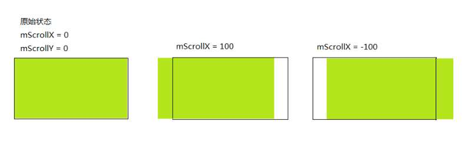

# View的事件体系

| tag     | author     | date       | history             |
| ------- | ---------- | ---------- | ------------------- |
| Android | caizhenghe | 2018-03-11 | create doc          |
| Android | caizhenghe | 2018-03-12 | add project example |

[TOC]

## View的基础知识

### 什么是View

View在Android官方文档中的描述：

> This class represents the basic building block for user interface components. A View occupies a rectangular area on the screen and is responsible for drawing and event handling. View is the base class for widgets,which are used to create interactive UI components(buttons, text fields, etc.). The ViewGroup subclass is the base class for layouts, which are invisible containers that hold other Views(or other ViewGroups) and define their layout properties.

View是Android中所有控件的基类，不管是ImageView、TextView还是RelativeLayout，它们共同的基类都是View。除了View还有ViewGroup，从字面意思上看，它是一个控件组，它内部可以包含多个控件，从实现上来说，ViewGroup也继承了View，因此View既可以是单个控件也可以是一组控件，ViewGroup内部的控件也是View或者ViewGroup，最终就形成了View树的结构。

### View的位置参数

- View的位置由它的四个顶点决定：top、left、right、down。这几个值均是相对父容器的坐标，其中top是左上角的纵坐标，left是左上角的横坐标，right是右下角的横坐标，down是右下角的纵坐标。这四个属性分别可以通过View的getTop()、getLeft()、getRight()、getTop()方法获取。

- 从Android3.0开始，View增加了几个额外参数：x、y、translationX、translationY，这几个值也是相对父容器的坐标。x和y表示View左上角的坐标；translationX和translationY表示View左上角相对于父容器的偏移量，并且translationX和translationY的值默认是0。它们之间的换算关系如下表示：

  ```java
  x = translationX + left
  ```

  > 实际上x、y、translationX、translationY这一系列参数均是为属性动画准备的。View在平移过程中，top、left、right、down这四个原始的位置信息不会改变，发生改变的是x、y、translationX、translationY参数。


- View还有两个常见的参数scrollX、scrollY。它们表示**View的内容的位置**而不是View本身在布局中的位置。其中scrollX表示View的左边缘与View的内容的左边缘的水平距离：

  ```java
  // pseudo-code
  scrollX = view.left - view.content.left
  ```

  

### MotionEvent

典型的事件类型有如下几种：ACTION_DOWN、ACTION_MOVE、ACTION_UP，通过MotionEvent我们可以得到点击事件的x坐标和y坐标：getX()/getY()和getRawX()/getRawY()。getX()/getY()返回相对于当前View左上角的x和y坐标， getRawX()/getRawY()返回相对于手机屏幕左上角的x和y坐标。

### 项目中的实际应用

之前项目中实现了一个带删除按钮的编辑框，但是在一些情况下会发生点击失效的问题：点击删除按钮不响应，点击删除按钮偏左上角一些的位置反而能够响应删除动作，下面是修改之前的代码（只提供了关键实现）：

```java
// 处理删除按钮事件
@Override
public boolean onTouchEvent(MotionEvent event) {
  if (mEnableClearBtn && mClearBtnDrawable != null && event.getAction() == MotionEvent.ACTION_UP) {
    int eventX = (int) event.getRawX();
    int eventY = (int) event.getRawY();
    Rect globalRect = new Rect();
    getGlobalVisibleRect(globalRect);
    globalRect.left = globalRect.right - TPUtils.dp2px(DRAWABLE_WIDTH_IN_DP, getContext());
    if (globalRect.contains(eventX, eventY)) {
      // 当点击事件在删除按钮范围内时，响应删除动作
    }
  }
  return super.onTouchEvent(event);
}
```

> getGlobalVisibleRect()的字面意思为获取该控件可见区域的全局位置信息，根据测试结果，该方法会返回一个相对窗口（Window）左上角的坐标。这么做在Activity中通常是没有问题的，因为Activity的窗口坐标系的原点正好和getRawX/Y坐标系的原点重合（均在屏幕左上角）；但是如果在DialogFragment中使用该方法，由于DialogFragment自身持有一个Window且该Window通常不占据整个屏幕，因此它的窗口坐标系的原点与触摸事件中getRawX/Y坐标系的原点不重合，导致计算范围时出现偏差，点击事件失效。

上述代码应该改成使用相对坐标，修改之后的代码：

```java
// 处理删除按钮事件
@Override
public boolean onTouchEvent(MotionEvent event) {
  if (mEnableClearBtn && mClearBtnDrawable != null && event.getAction() == MotionEvent.ACTION_UP) {
    int eventX = (int) event.getX();
    int eventY = (int) event.getY();
    Rect localRect = new Rect();
    getLocalVisibleRect(localRect);
    localRect.right = getWidth();
    localRect.left = localRect.right - TPUtils.dp2px(DRAWABLE_WIDTH_IN_DP, getContext());
    if (localRect.contains(eventX, eventY)) {
      // 当点击事件在删除按钮范围内时，响应删除动作
    }
  }
  return super.onTouchEvent(event);
}
```

> getLocalVisibleRect()表示控件可见区域相对于**控件中内容左上角**的位置信息。getX()/getY()表示触摸事件相对于控件左上角的坐标信息，两者的坐标系保持一致，能够正确响应点击事件。

## 事件分发机制

### 再论MontionEvent

所谓点击事件的事件分发，其实就是对MotionEvent事件的分发过程，当一个MotionEvent产生之后，系统需要把这个事件传递给一个具体的View，这个传递的过程就是分发过程。通常我们将从手指接触屏幕，到手指离开屏幕的过程中产生的一系列事件称之为**同一个事件序列**。这个事件序列以down事件开始，中间含有数量不等的move事件（可以没有move事件），最终以up事件结束。

### 事件传递规则

#### 点击事件的传递顺序

点击事件由三个很重要的方法共同完成：dispatchTouchEvent、onInterceptTouchEvent、onTouchEvent。

- dispatchTouchEvent：用来进行事件的分发，如果事件能够传递到当前View，此方法一定会被调用，返回结果受当前View的onTouchEvent和下级的dispatchTouchEvent方法的影响，表示是否消耗当前事件（自身或者下级View消耗）。


- onInterceptTouchEvent：用来判断是否拦截某个事件，此方法仅在ViewGroup中定义（View中没有该方法），返回结果表示是否拦截当前事件。


- onTouchEvent：在dispatchTouchEvent中调用，用来处理点击事件，返回结果表示是否消耗当前事件。

上述三个方法的关系可以用如下伪代码来表示：

```java
// pseudo-code
public boolean dispatchTouchEvent(MotionEvent ev) {
  boolean consume = false;
  if(onInterceptTouchEvent(ev)) {
  	consume = onTouchEvent(ev);
  } else {
  	consume = child.dispatchTouchEvent(ev);
  }
} 
```

> Tips1：
>
> 对一个根ViewGroup来说，点击事件首先传递给它，它的dispatchTouchEvent会被调用，如果这个ViewGroup的onInterceptTouchEvent方法返回true表示它要拦截当前事件，接着事件会交给这个ViewGroup处理，即它的onTouchEvent方法会被调用，如果这个ViewGroup的onInterceptTouchEvent方法返回false就表示它不会拦截事件，这是当前事件就会继续传递给它的子元素，接着子元素的dispatchTouchEvent方法就会被调用，如此反复直到事件被最终处理。
>
> Tips2：
>
> 一个事件产生后，它的传递过程遵循如下顺序：Activity->Window->View。如果一个View的onTouchEvent返回false，那么它的父容器的onTouchEvent将会被调用，依次类推，如果所有元素都不处理这个事件，那么这个事件将会最终传递给Activity处理，即Activity的onTouchEvent将会被回调（**仅限于ACTION_DOWN**）。


#### 点击事件在View中的处理逻辑

当一个View需要处理事件时，如果它设置了OnTouchListener，那么onTouchListener中的onTouch的方法会被调用：如果返回false，则View中的onTouchEvent方法会被调用；如果返回true，则onTouchEvent方法不会被调用。在onTouchEvent方法中，如果当前设置了onClickListener，那么它的onClick方法会被调用，三者的优先级关系为：

> onTouchListener > onTouchEvent > onClickListener

View的相关源码如下所示：

```java
public boolean dispatchTouchEvent(MotionEvent event) {             
  ...
  ListenerInfo li = mListenerInfo;
  if (li != null && li.mOnTouchListener != null
      && (mViewFlags & ENABLED_MASK) == ENABLED
      && li.mOnTouchListener.onTouch(this, event)) {
    result = true;
  }

  if (!result && onTouchEvent(event)) {
    result = true;
  }
  ...
  return result;
}

public boolean onTouchEvent(MotionEvent event) {
  ...
  switch (action) {
    case MotionEvent.ACTION_UP:
      ...
      if (mPerformClick == null) {
         mPerformClick = new PerformClick();
      }
      if (!post(mPerformClick)) {
         performClick();
      }
      ...
      break;
  }
  ...
}

public boolean performClick() {
  final boolean result;
  final ListenerInfo li = mListenerInfo;
  if (li != null && li.mOnClickListener != null) {
    playSoundEffect(SoundEffectConstants.CLICK);
    li.mOnClickListener.onClick(this);
    result = true;
  } else {
    result = false;
  }
  sendAccessibilityEvent(AccessibilityEvent.TYPE_VIEW_CLICKED);
  notifyEnterOrExitForAutoFillIfNeeded(true);
  return result;
}
```


### 事件传递相关结论

1. 某个View一旦决定拦截，那么这一个事件序列都只能由它处理（如果事件序列能够传递给它的话），并且它的onInterceptTouchEvent不会再被调用。若View拦截了down，则子View将收不到整个事件序列；如果View拦截了除down以外的其它事件，子View将收到一个cancel，不会收到后续的事件序列。

   ViewGroup中dispatchTouchEvent的相关源码：

2. 某个View一旦开始处理事件，如果它不消耗down事件，那么同一事件序列中的其它事件都不会再交给它处理，并且事件将重新交给它的父元素处理，即父元素的onTouchEvent将被调用。

3. 如果View不消耗除了down以外的其它事件，那么这个点击事件将会消失，此时父元素的onTouchEvent并不会被调用，并且当前View可以持续受到后续的事件，最后这些消失的点击事件会传递给Activity处理。

   ViewGroup中dispatchTouchEvent的相关伪代码：

   ```java
   // Check for interception.
   final boolean intercepted;
   if (actionMasked == MotionEvent.ACTION_DOWN || mFirstTouchTarget != null) {
     final boolean disallowIntercept = (mGroupFlags & FLAG_DISALLOW_INTERCEPT) != 0;
     if (!disallowIntercept) {
       intercepted = onInterceptTouchEvent(ev);
       ev.setAction(action); // restore action in case it was changed
     } else {
       intercepted = false;
     }
   } else {
     // There are no touch targets and this action is not an initial down
     // so this view group continues to intercept touches.
     intercepted = true;
   }

   // pseudo-code
   boolean handled = false;
   if(!intercepted){
     // child处理事件
     handled = child.dispatchTouchEvent(ev);
     if(handle) {
       mFirstTouchTarget = new TouchTarget();
     }
   }

   if(mFirstTouchTarget == null) {
     // parent自己处理事件
     handled = onTouchEvent(ev);
   } else {
     // parent拦截事件后，将mFirstTouchTarget置为空且给child分发一个cancel事件
     if(intercepted) {
       mFirstTouchTarget = null;
       child.dispatchTouchEvent(cancelEv);
     }
   }
   ```

   ​

4. ViewGroup默认不拦截任何事件。

5. View没有onInterceptTouchEvent方法，一旦有点击事件传递给它，它的onTouchEvent方法就会被调用。

6. View的onTouchEvent默认都会消耗事件，除非他是不可点击的（clickable和longClickable同时为false）。View的longClickable属性默认都为false，clickable属性要分情况，比如Button的clickable属性默认为true，而TextView的clickable属性默认为false。（**View的enable属性不影响onTouchEvent的默认返回值，只是不会对事件作出响应**）

   View的onTouchEvent相关源码：

   ```java
   final boolean clickable = ((viewFlags & CLICKABLE) == CLICKABLE
                              || (viewFlags & LONG_CLICKABLE) == LONG_CLICKABLE)
     || (viewFlags & CONTEXT_CLICKABLE) == CONTEXT_CLICKABLE;
   if ((viewFlags & ENABLED_MASK) == DISABLED) {
     if (action == MotionEvent.ACTION_UP && (mPrivateFlags & PFLAG_PRESSED) != 0) {
       setPressed(false);
     }
     mPrivateFlags3 &= ~PFLAG3_FINGER_DOWN;
     // A disabled view that is clickable still consumes the touch
     // events, it just doesn't respond to them.
     return clickable;
   }
   if (clickable){
     // do something
     return true;
   }
   return false;
   ```


## 滑动冲突

### 冲突场景

- 外部滑动方向和内部滑动方向不一致
- 外部滑动方向和内部滑动方向一致
- 上述两种情况的嵌套

### 解决方式

通常我们会从业务需求出发来寻求解决方式，常见的解决方式有如下两种：

#### 外部拦截法

外部拦截法是指点击事件都先经过父容器的拦截处理，如果父容器需要此事件就拦截，如果不需要此事件就不拦截，这样就解决了滑动冲突的问题。外部拦截法需要重写父容器的onInterceptTouchEvent方法，相关伪代码如下所示：

```java
@Override
public boolean onInterceptTouchEvent(MotionEvent event) {
  boolean intercepted = false;
  switch(event.getAction()) {
    case MotionEvent.ACTION_DOWN:{
      // 不可以拦截 ACTION_DOWN 否则后续事件都会交由父容器来处理
      intercepted = false
        break;
    }
    case MotionEvent.ACTION_MOVE:{
      if(父容器需要拦截当前事件) {
        intercept = true;
      } else {
        intercept = false;
      }
      break;
    }
    case MotionEvent.ACTION_UP:{
      intercept = false;
      break;
    }
    default:
      break;
  }

  return intercept;
}
```

#### 内部拦截法

内部拦截法是指父容器不拦截任何事件，所有事件都传递给子元素，如果子元素需要此事件就直接消耗掉，否则就交由父容器进行处理，这种方法需要配合requestDisallowInterceptTouchEvent方法，写法较为复杂：

首先重写子元素的dispatchTouchEvent方法，在down时禁止父View拦截事件，在move时进行判断，若满足一定条件，则允许父View拦截事件：

```java
@Override
public boolean dispatchTouchEvent(MotionEvent ev) {
  int x= (int) ev.getX();
  int y= (int) ev.getY();
  switch (ev.getAction())
  {
    case MotionEvent.ACTION_DOWN:
      getParent().requestDisallowInterceptTouchEvent(true);
      break;
    case MotionEvent.ACTION_MOVE:
      int deltaX=x-mLastX;
      int deltaY=x-mLastY;
      if (父容器需要当前点击事件)
      {
        getParent().requestDisallowInterceptTouchEvent(false);
      }
      break;
  }
  mLastX=x;
  mLastY=y;
  return super.dispatchTouchEvent(ev);
}
}
```

其次重写父View的onInterceptTouchEvent方法，在down时不拦截事件，其余操作时拦截事件，这样做可以保证一旦子View允许父View拦截事件，立马将事件拦截：

```java
@Override
public boolean onInterceptTouchEvent(MotionEvent ev) {
  int action=ev.getAction();
  if (action==MotionEvent.ACTION_DOWN)
  {
    return false;
  }else 
  {
    return true;
  }
}
```

### 项目中的实际应用

#### 布局结构

在实际项目中，客流量统计模块中有一个较复杂的滑动冲突的问题。布局结构如下图所示：

- SwipeRefreshLayout  -Android原生的下拉刷新控件
  - LoadingView        -下拉刷新加载布局
  - ScrollView            -纵向滚动布局
    - ViewPager    -横向滑动的翻页控件
      - HistogramView -直方图控件

业务需求：当进行长按（并拖动）或者短按点击操作时，由HistogramView 消耗事件；当进行短按并横向拖动操作时，由ViewPager消耗事件；当进行短按并纵向拖动操作时，由LoadingView 消耗事件。

#### 解决思路

实际上长按操作以及短按点击操作不会引起滑动冲突，只有长按并拖动操作会与ViewPager或者LoadingView 产生冲突：

- Android自带控件ViewPager进行事件拦截的逻辑：当横向滑动的距离大于纵向滑动距离的两倍时拦截事件。


- Android自带控件SwipeRefreshLayout中的LoadingView进行事件拦截的逻辑：当纵向滑动的距离大于TouchSlop时拦截事件。

为了统一处理事件的逻辑，这里采用内部拦截法来解决滑动冲突，基本思想如下：

重写HistogramView 的onTouchEvent方法，当监听到down事件时，直接禁止父View拦截事件。

> 这里还有一个要注意的地方：LoadingView不是HistogramView 的直系血亲，它是ViewPager的叔叔，无法使用requestDisallowInterceptTouchEvent方法禁止LoadingView拦截事件，且触摸事件会优先分发给LoadingView处理，所以我们需要通过定义回调接口的方式禁止LoadingView拦截事件，具体的接口实现是在Activity中调用SwipeRefreshLayout.setEnabled(false)方法禁止LoadingView拦截事件。

```java
@Override
public boolean onTouchEvent(MotionEvent event) {
    switch (event.getAction()) {
        case MotionEvent.ACTION_DOWN:
            mDownX = event.getX();
            mDownY = event.getY();
            mDownTime = System.currentTimeMillis();

            // 一旦事件被父View拦截，后续所有事件都不会分发到此View，因此在Down时就禁止父View拦截事件
            getParent().requestDisallowInterceptTouchEvent(true);
            // 禁止刷新控件进行刷新
            if (mRefreshCallback != null) {
                mRefreshCallback.setRefreshEnable(false);
            }
            break;
        case MotionEvent.ACTION_MOVE:
            // 部分手机ACTION_MOVE事件比较灵敏，需要设定一个TouchSlop的阈值
            float x = (event.getX() - mDownX) * (event.getX() - mDownX);
            float y = (event.getY() - mDownY) * (event.getY() - mDownY);
            ViewConfiguration vf = ViewConfiguration.get(getContext());
            if (Math.sqrt(x + y) <= vf.getScaledTouchSlop())
                break;
            // 计算第一次MOVE与DOWN的时间间隔
            if (mFirstMoveTime == 0) {
                mFirstMoveTime = System.currentTimeMillis();
            }
            if (mFirstMoveTime - mDownTime < DEFAULT_LONG_PRESS_INTERVAL) {
                // 若Move与Down之间间隔小于300ms，则允许父View拦截事件，将滑动事件重新交给父View处理
                getParent().requestDisallowInterceptTouchEvent(false);
                // 允许下拉刷新
                if (mRefreshCallback != null) {
                    mRefreshCallback.setRefreshEnable(true);
                }
            }
            break;
        case MotionEvent.ACTION_UP:
            // 若中间没有Move则认为是点击/长按事件，由子View进行相关操作
            if (mFirstMoveTime == 0) {
                // do something
            }
            resetEvent();
            break;
        case MotionEvent.ACTION_CANCEL:
            // 当触摸事件被父View拦截时最终会回调该事件，重置mDownTime和mFirstMoveTime
            // 不在拦截条件刚触发时就重置变量，因为后续父View的dispatchEvent依然会分发多个MOVE事件给此View，重新给mFirstMoveTime赋值，导致重置失效
            resetEvent();
            break;
    }
    return true;
}
```

> 解决了HistogramView与ViewPager/SwipeRefreshLayout的滑动冲突后，还需要考虑ViewPager和SwipeRefreshLayout之间的滑动事件的优先级问题，目前的实现是当触发SwipeRefreshLayout的滑动条件时，优先进行下拉刷新操作，若未触发则进行ViewPager的左右滑动操作。这点可以根据后续的需求和反馈来进行优化。

