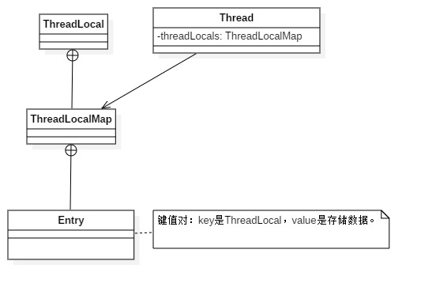
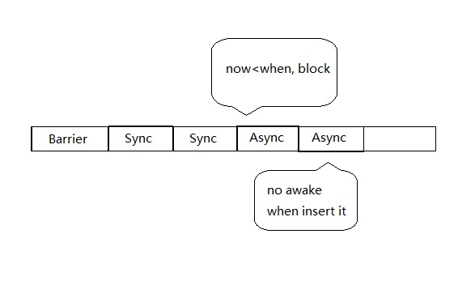

# Android消息机制

| 版本/状态 | 责任人 | 起止日期   | 备注                           |
| --------- | ------ | ---------- | ------------------------------ |
| V1.0/草稿 | 蔡政和 | 2018-03-18 | 创建消息机制文档               |
| V1.0/草稿 | 蔡政和 | 2019-01-24 | 更新文档，补充MessageQueue章节 |

## Handler

### 概要

Handler用于线程间的消息传递，它可以将一个线程中的任务切换到另一个线程执行。切换的目标线程与Handler内部持有的**Looper所在线程**一致。若初始化Handler时未手动设置Looper，Handler会通过ThreadLocal获取并持有当前（初始化Handler时）线程的Looper。当Handler发送一条消息后，这条消息会进入目标线程的MessageQueue，目标线程的Looper扫描并且取出消息，最终由Handler执行这条消息。


### 构造器

Handler的构造器大致分为以下两种：

```java
public Handler(Callback callback, boolean async){}
public Handler(Looper looper, Callback callback, boolean async){}
```

构造器的参数列表：

- callback：Handler处理消息的接口回调，执行消息时可能会调用该接口。
- async：默认false，若该值为true，则消息队列中的所有消息均是AsyncMessage。AsyncMessage的概念请看后续章节。
- looper：消息的查询者，会不断轮询检查MessageQueue是否有消息。

若调用者传递Looper，直接使用该Looper；否则通过ThreadLocal从当前线程中获取Looper。所以执行任务所在的目标线程**不是创建Handler时所在的线程，而是Looper所在的线程**。

### sendMessageAtTime

无论是使用post(Runnable r)还是sendMessage(Message m)发送消息，最终都会执行到sendMessageAtTime方法。该方法指定了Message的执行者（**msg.target=handler**）和调用时机（msg.when）。

### dispatchMessage

dispatchMessage方法用于执行事先注册的Message和Handler回调，源码如下：

```java
 public void dispatchMessage(Message msg) {
     if (msg.callback != null) {
         handleCallback(msg);
     } else {
         if (mCallback != null) {
             if (mCallback.handleMessage(msg)) {
                 return;
             }
         }
         handleMessage(msg);
     }
 }
```

可以发现回调的优先级是：Message的回调>Handler的回调（构造器章节中的callback）>Handler子类重写的handleMessage方法。

## ThreadLocal

ThreadLocal是一个线程内部的数据存储类，用于存放以线程为作用域的数据，在不同的线程中可以持有不同的数据副本。通过ThreadLocal就可以很方便的查找到当前线程的Looper。ThreadLocal内部实现的UML类图如下：



通过ThreadLocal查找Looper的流程如下：

1. 通过Thread.currentThread()获取当前线程对象。
2. 取出线程对象持有的ThreadLocalMap对象。
3. 以自身为key，获取ThreadLocalMap中对应Entry的value。

## Looper

Looper在Handler中扮演着消息循环的角色。它会不断查询MessageQueue中是否有消息。当没有消息时Looper将一直阻塞。

若当前线程没有Looper，且调用者未传Looper，Handler会因为未获取Looper而报错。解决办法是通过Looper.prepare在当前线程手动创建一个Looper，并通过Looper.loop开启消息循环：

```java
new Thread("Thread#2") {
    @override
    public void run() {
        Looper.prepare();
        Handler handler = new Handler();
        Looper.loop();
    }
}
```

Looper提供了quit和quitSafely两种方式来退出一个Looper。区别在于前者会直接退出；后者则是在处理完消息队列的已有消息后才安全退出。

Looper所在的线程会一直处于运行状态，所以建议消息处理完毕后及时退出Looper，释放线程。

## MessageQueue

MessageQueue是消息的存储队列，内部提供了很多精彩的机制。

### IdleHandler

IdleHandler本质上只是一个抽象的回调接口，没有做任何操作：

```java
/**
 * Callback interface for discovering when a thread is going to block
 * waiting for more messages.
 */
public static interface IdleHandler {
    /**
     * Called when the message queue has run out of messages and will now
     * wait for more.  Return true to keep your idle handler active, false
     * to have it removed.  This may be called if there are still messages
     * pending in the queue, but they are all scheduled to be dispatched
     * after the current time.
     */
    boolean queueIdle();
}
```

看上述注释可以了解，MessageQueue会在将要进入阻塞时执行IdleHandler的queueIdle方法，队列阻塞的触发时机是：

- 消息队列没有消息。
- 队首消息的执行时间大于当前时间。

当我们希望一个任务在队列下次将要阻塞时调用，就可以使用IdleHandler。在Android工程中最常见的例子就是：**给Activity提供生命周期以外的回调**。

比如我希望在布局绘制完成后执行某个操作，但是Activity的onStart和onResume回调均在View绘制完成之前执行，可以看看onResume的官方注释：

```java
/**
 * ...
 * <p>Keep in mind that onResume is not the best indicator that your activity
 * is visible to the user; a system window such as the keyguard may be in
 * front.  Use {@link #onWindowFocusChanged} to know for certain that your
 * activity is visible to the user (for example, to resume a game).
 * ...
 */
  @CallSuper
  protected void onResume() {...}
```

这种情况下就可以给MessageQueue设置一个IdleHandler，等当前队列中的消息（包括绘制任务）执行完毕并将要进入阻塞状态时，调用IdleHandler的任务，确保任务在绘制结束后执行。

使用方式如下所示：

```java
 if (Build.VERSION.SDK_INT >= Build.VERSION_CODES.M) {
     Looper.myLooper().getQueue().addIdleHandler(new MessageQueue.IdleHandler() {
         @Override
         public boolean queueIdle() {
             // do something when queue is idle
             // 返回值表示bKeepAlive标识：true->继续使用，false->销毁该Handler
             return false;
         }
     });
}
```

### AsyncMessage和SyncBarrier

顾名思义，SyncBarrier表示同步栅栏（也叫作障碍消息），用于阻塞SyncMessage，优先执行AsyncMessage。该机制大大提升了MessageQueue的操作灵活性。

在进一步了解这两个概念之前，需要先了解MessageQueue插入消息的机制，MessageQueue的enqueueMessage源码如下（省略了唤醒队列的相关代码）：

```java
boolean enqueueMessage(Message msg, long when) {
     synchronized (this) {
         msg.markInUse();
         msg.when = when;
         Message p = mMessages;
         if (p == null || when == 0 || when < p.when) {
             // New head.
             msg.next = p;
             mMessages = msg;
         } else {
             // Inserted within the middle of the queue.  
             Message prev;
             for (;;) {
                 prev = p;
                 p = p.next;
                 if (p == null || when < p.when) {
                     break;
             }
         }
         msg.next = p; // invariant: p == prev.next
         prev.next = msg;
     }
     return true;
}
```

从上述源码可知，消息按照调用时机（when）有序排列，当when等于0时，直接将消息插在队头；当when等于队列中消息的when时，将消息插在这些消息的后方。

假设这样一个场景：我们有一个非常紧急的任务，希望能够优先执行，该如何处理？

很简单，发送一个when为0的消息，它将自动被插到列表的头部。Handler中也提供了现成的接口：

```java
public final boolean postAtFrontOfQueue(Runnable r)
{
    return sendMessageAtFrontOfQueue(getPostMessage(r));
}

public final boolean sendMessageAtFrontOfQueue(Message msg) {
	return enqueueMessage(queue, msg, 0);
}
```

将场景升级一下：我们有一个任务A，其他所有任务都依赖于A，若A未执行，则其他所有任务都不允许执行。

A插入队列的时间和执行时间都是不确定的，在此之前，所有任务都不允许执行。按照当前的机制无法实现该需求，此时SyncBarrier和AsyncMessage就派上了用场，实现流程如下：

1. 调用MessageQueue.postSyncBarrier将SyncBarrier插入队列：SyncBarrier本质上是一个target为空的消息，插入逻辑和普通消息一致，也是按照when确定插入位置。SyncBarrier的when固定是**SystemClock.uptimeMillis()**，因此将其插入到队列的中间（SyncBarrier前面可能会有一些无时延的消息，后面可能会有带时延的消息）。

2. 插入SyncBarrier后，轮询消息直至SyncBarrier排到队列头节点，此时使用next方法查询消息将自动过滤同步消息，只执行异步消息。源码如下所示：

   ```java
   // mMessages表示队首消息
   Message msg = mMessages;
   if (msg != null && msg.target == null) {
       // Stalled by a barrier.  Find the next asynchronous message in the queue.
       do {
           prevMsg = msg;
           msg = msg.next;
       } while (msg != null && !msg.isAsynchronous());
   }
   ```

3. 插入任务A（将A定义为AsyncMessage），由于SyncBarrier的存在，A将优先被执行（不排除A有时延，此时队列将进入阻塞状态，即便队列里可能存在无时延的同步消息）。

4. 只要SyncBarrier放在队首，同步消息将一直被阻塞，消息队列只能输出AsyncMessage。当任务A执行完毕后，需要调用removeSyncBarrier手动将SyncBarrier移除。

Handler提供了接口让我们插入AsyncMessage，即构造器中的asyc参数。当async为true时，所有通过Handler传递的消息均会被定义为AsyncMessage（前提是要和SyncBarrier配合使用，不然AsyncMessage没有效果）。

再重新思考SyncBarrier和AsyncMessage机制的应用场景，本质上就是为了**阻塞从Barrier消息到AsyncMessage消息之间的同步消息的执行**。

在Android源码中，布局的绘制就使用了这种机制。在ViewRootImpl的scheduleTraversals方法中，会事先往主线程的消息队列设置Barrier，再去提交AsyncMessage，阻塞在此期间的所有同步消息。源码如下：

```java
void scheduleTraversals() {
	if (!mTraversalScheduled) {
	    mTraversalScheduled = true;
        // 设置Barrier
	    mTraversalBarrier = mHandler.getLooper().getQueue().postSyncBarrier();
        // 该方法最终会提交一个AsyncMessage
	    mChoreographer.postCallback(
	            Choreographer.CALLBACK_TRAVERSAL, mTraversalRunnable, null);
	    if (!mUnbufferedInputDispatch) {
	        scheduleConsumeBatchedInput();
	    }
	    notifyRendererOfFramePending();
	    pokeDrawLockIfNeeded();
	}
}
```

> Tips：关于Barrier的概念在Java并发中多有涉及，比如CountDownLatch、CyclicBarrier等。详情请查看《Thinking in Java》21.7章节。

### 阻塞和唤醒机制

阻塞和唤醒机制是MessageQueue的精髓，极大降低了Loop轮询的频率，减少性能开销。

在IdleHandler章节已经提及MessageQueue阻塞的时机：

- 消息队列没有消息。
- 队首消息的执行时间大于当前时间。

next方法的源码如下：

```java
Message next() {
    int nextPollTimeoutMillis = 0;
    for (;;) {
        if (nextPollTimeoutMillis != 0) {
            Binder.flushPendingCommands();
        }
        // 关键方法，将线程阻塞nextPollTimeoutMillis毫秒，若nextPollTimeoutMillis为-1，线程将一直处于阻塞状态。
        nativePollOnce(ptr, nextPollTimeoutMillis);
        synchronized (this) {
            // Ignore SyncBarrier code 
            final long now = SystemClock.uptimeMillis();
            Message prevMsg = null;
            Message msg = mMessages;
            if (msg != null) {
                if (now < msg.when) {
                    // Next message is not ready.  Set a timeout to wake up when it is ready.
                    nextPollTimeoutMillis = (int) Math.min(msg.when - now, Integer.MAX_VALUE);
                } else {
                    // Got a message.
                    mBlocked = false;
                    if (prevMsg != null) {
                        prevMsg.next = msg.next;
                    } else {
                        mMessages = msg.next;
                    }
                    msg.next = null;
                    msg.markInUse();
                    return msg;
                }
            } else {
                // No more messages.
                nextPollTimeoutMillis = -1;
            }
            // Ignore IdleHandler code
            if (pendingIdleHandlerCount <= 0) {
                // No idle handlers to run.  Loop and wait some more.
                mBlocked = true;
                continue;
            }
        }
    }
}
```

插入消息时唤醒MessageQueue的时机（假设队列处于阻塞状态）：

- 队首插入一条SyncMessage。
- 队首是一个栅栏，且插入一条离栅栏最近的AsyncMessage。

enqueueMessage方法的源码如下：

```java
boolean enqueueMessage(Message msg, long when) {
	synchronized (this) {
	    msg.markInUse();
	    msg.when = when;
	    Message p = mMessages;
	    boolean needWake;
	    if (p == null || when == 0 || when < p.when) {
	        // New head, wake up the event queue if blocked.
	        msg.next = p;
	        mMessages = msg;
	        needWake = mBlocked;
	    } else {
	        // Inserted within the middle of the queue.  Usually we don't have to wake
	        // up the event queue unless there is a barrier at the head of the queue
	        // and the message is the earliest asynchronous message in the queue.
	        needWake = mBlocked && p.target == null && msg.isAsynchronous();
	        Message prev;
	        for (;;) {
	            prev = p;
	            p = p.next;
	            if (p == null || when < p.when) {
	                break;
	            }
	            if (needWake && p.isAsynchronous()) {
	                needWake = false;
	            }
	        }
	        msg.next = p; // invariant: p == prev.next
	        prev.next = msg;
	    }	
	    // We can assume mPtr != 0 because mQuitting is false.
	    if (needWake) {
            // 关键方法，用于唤醒队列线程
	        nativeWake(mPtr);
	    }
	}
	return true;
}
```

唤醒的第二种时机特意强调了插入**离Barrier最近的AsyncMessage**。对于如下的阻塞情况，插入AsyncMessage时不需要将其唤醒：



## Handler内存泄漏分析

了解了Handler的内部原理后，再来分析由Handler引起的内存泄露问题：

1. 当定义了一个非静态的Handler内部类时，内部类会隐式持有外围类的引用。
2. Handler执行sendMessageAtTime方法时，Message的target参数会持有Handler对象。
3. 当Message没有被执行时（比如now<when），若退出了Activity，此时Message依然持有Handler对象，而Handler持有Activity的对象，导致内存泄露。

解决方案：

1. 将Handler定义为静态内部类。
2. 退出Activity时清空MessageQueue中对应的Message。

