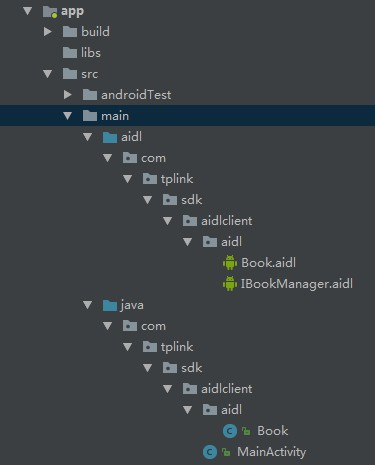
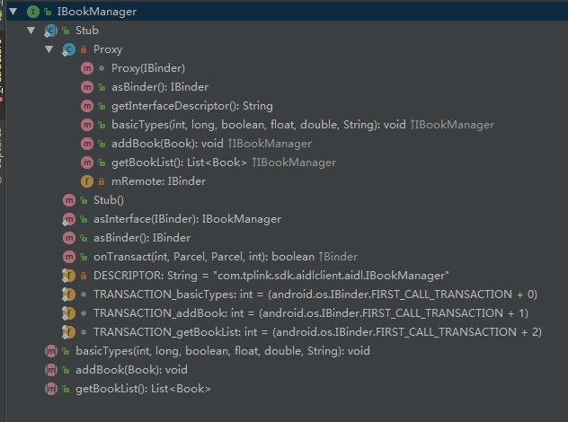

# Android IPC机制

| 版本/状态 | 责任人 | 起止日期   | 备注                    |
| --------- | ------ | ---------- | ----------------------- |
| V1.0/草稿 | 蔡政和 | 2019/01/26 | 创建Android IPC机制文档 |
| V1.0/草稿 | 蔡政和 | 2019/01/29 | 添加Messenger章节       |
| V1.0/草稿 | 蔡政和 | 2019/02/15 | 完善Binder章节          |

[TOC]

## IPC简介

### 概念

IPC，全称是Inner-Process Communication，表示进程间通信或跨进程通信。首先我们先了解一下进程和线程的概念：

- 线程是CPU调度的最小单元。
- 进程是操作系统分配资源的最小单元。在PC或移动端，进程通常代表着一个执行中的程序或者APP实例，一个进程可以包含多个线程（在Linux中线程本质上是特殊的进程）。

再延伸一下，什么是计算机资源？经典的冯诺依曼结构把计算机系统抽象成CPU+存储器+IO，那么计算机资源无非两种：

- 计算资源
- 存储资源

在Android系统中，每个进程跑在各自的JVM实例上（JVM实例本质上也是一个进程），操作系统会为每个JVM实例分配一块独立的存储空间。因此**进程应该是系统分配存储资源的最小单元**。

IPC机制并非Android特有，任何一个操作系统都需要IPC机制：

- Windows：剪贴板、管道、邮槽等。
- Linux：命名管道、共享内存、信号量等。
- Android：Binder、AIDL、Messenger、Socket、ContentProvider、文件共享等。

### 应用场景

IPC机制通常都应用在多进程场景中。多进程的情况分为两种：

- 一个应用因为某些原因自身需要采用多进程模式来实现，原因可能有：
  - 有些模块由于特殊原因需要运行在单独的进程中（比如安防项目的APP更新模块）。
  - 加大一个应用可使用的内存（Android对单个应用所使用的最大内存做了限制，早期某些版本是16MB，不同设备有不同的大小）。
- 当前应用需要向其他应用获取数据。

## Android的多进程模式

### 开启多进程模式

只需要给四大组件指定android:process属性，就可以轻易的开启多进程。开启多进程的代码如下：

```xml
<activity android:name=".MainActivity">
    <intent-filter>
        <action android:name="android.intent.action.MAIN" />
        <category android:name="android.intent.category.LAUNCHER" />
    </intent-filter>
</activity>
<activity android:name=".SecondActivity"
    android:process=":remote">
</activity>
<activity android:name=".ThirdActivity"
    android:process="com.czh.ffmpeg.remote">
</activity>
```

MainActivity没有指定process参数，运行在默认进程中，它的进程名就是包名："com.czh.ffmpeg"

SecondActivity指定了进程的缩略名，完整进程名是："com.czh.ffmpeg:remote"

ThirdActivity指定了进程的完整名字："com.czh.ffmpeg.remote"

进程名以“：”开头的进程属于当前应用的私有进程，其它应用的组件不能和它跑在同一个进程；不以”：“开头的进程属于全局进程，其它应用通过ShareUID可以和它跑在同一个进程。

两个应用跑在同个进程的前提是拥有相同ShareUID和签名。只要ShareUID和签名相同，无论是否在同一进程，两个应用均可共享私有数据，比如data目录、组件信息等；如果ShareUID、签名和进程均相同，两个应用还可以共享内存数据。

### 多进程模式的运行机制

在第一章节已经提到，进程是系统分配存储资源的最小单元。多进程之间共享内存数据（比如static变量）注定是失败的。在不同的虚拟机中访问同一个类的对象，会产生不同的数据副本。一般来说，使用多进程会造成如下几方面的问题：

1. 静态成员和单例模式失效。
2. 线程同步机制失效。
3. SharedPreferences可靠性降低。
4. Application会多次创建。

前两个问题很好理解。第三个问题是因为SharedPreferences不支持两个进程同时执行写操作（因为底层是通过读写XML文件实现的）。第四个问题是由于当一个组件跑在新进程中时，系统要创建新的进程并且分配独立的虚拟机，这其实就是启动一个应用的过程，所以会创建新的Application。针对第四个问题的测试代码如下：

```java
public class BaseApplication extends android.app.Application {
    private static final String TAG = BaseApplication.class.getSimpleName();

    @Override
    public void onCreate() {
        super.onCreate();

        String processName = "";
        ActivityManager manager = (ActivityManager) getApplicationContext().getSystemService(Context.ACTIVITY_SERVICE);
        for (ActivityManager.RunningAppProcessInfo process: manager.getRunningAppProcesses()) {
            if(process.pid == Process.myPid())
            {
                processName = process.processName;
            }
        }

        Log.e(TAG, "application onCreate: process name = " + processName);
    }
}
```

运行结果如下所示：


虽然多进程有很多问题，但是在前面章节提到的场景中我们依然需要使用它。系统给我们提供了很多跨进程通信的方法，虽然不能直接共享内存，但我们还是可以通过跨进程通信进行数据交互。

## AIDL

AIDL是一种基于Binder的进程间通信的机制，本章节主要介绍AIDL的使用方法，在下一章节会结合AIDL具体分析Binder的上层原理。

### 客户端

创建代表客户端的工程AIDLClient，添加三个文件：Book.java（Bean）、Book.aidl（Bean的aidl映射）、IBookManager.aidl（逻辑业务相关的aidl文件）。文件结构如下所示：



1. Book.java实现了parcelable接口，源码如下所示：

   ```java
   /* 省略Parcelable相关接口。可以直接使用快捷键Alt+Instert生成 */
   public class Book implements Parcelable {
       public int bookId;
       public String bookName;
   }
   ```

2. 鼠标放到aidl目录，点击右键->New->AIDL File，新建IBookManager.aidl文件。系统会自动将aidl文件添加到main目录下对应的aidl路径。IBookManager.aidl源码如下：

   ```java
   // IBookManager.aidl
   package com.tplink.sdk.aidlclient.aidl;
   // 需要显式导入Book类
   import com.tplink.sdk.aidlclient.aidl.Book;
   
   // Declare any non-default types here with import statements
   interface IBookManager {
       void addBook(in Book book);
       List<Book> getBookList();
   }
   ```

3. 在aidl路径下添加Book.aidl文件，源码如下：

   ```java
   package com.tplink.sdk.aidlclient.aidl;
   
   parcelable Book;
   ```

准备好上述三个文件后，点击Build，系统会自动在build->generated->source->aidl->debug目录下生成IBookManager.java文件。该文件的结构图如下所示：



准备好AIDL文件，并且搭建服务端相关环境后，在MainActivity中隐式绑定服务端的Service：

```java
public class MainActivity extends AppCompatActivity {
    private IBookManager mIBookManager;
    private int mBookId = 0;

    ServiceConnection mConn = new ServiceConnection() {
        @Override
        public void onServiceConnected(ComponentName name, IBinder service) {
            mIBookManager = IBookManager.Stub.asInterface(service);
        }

        @Override
        public void onServiceDisconnected(ComponentName name) {
            mIBookManager = null;
        }
    };

    @Override
    protected void onCreate(Bundle savedInstanceState) {
        super.onCreate(savedInstanceState);
        setContentView(R.layout.activity_main);
        Intent intent = new Intent();
        ComponentName name = new ComponentName("com.tplink.sdk.aidlserver", "com.tplink.sdk.aidlserver.AIDLService");
        intent.setComponent(name);
        bindService(intent, mConn, BIND_AUTO_CREATE);
    }

    @Override
    protected void onDestroy() {
        super.onDestroy();
        unbindService(mConn);
    }
}
```

注意：

- 需要在Intent中设置ComponentName参数，参数的构造规则是："包名"，"包名.类名"。
- 绑定Service时需要传递ServiceConnection参数，绑定成功后会执行onServiceConnected回调，服务器通过该回调返回已实现的IBinder接口（Stub）。客户端将其转换成IBookManager接口，并通过该接口发送相关请求。

### 服务端

创建代表服务端的工程AIDLServer，将客户端生成的IBookManager.java复制到该工程中。

**Notice：服务器的Book.java和IBookManager.java的包名、类名、DESCRIPTOR标识必须和客户端保持一致**。

添加AIDLService文件，用于向客户端返回服务端实现的Binder对象，源码如下：

```java
public class AIDLService extends Service {
    private static final String TAG = AIDLService.class.getSimpleName();
    private CopyOnWriteArrayList<Book> mBookList;
    private IBinder mBinder = new IBookManager.Stub() {

        @Override
        public void addBook(Book book) throws RemoteException {
            mBookList.add(book);
        }

        @Override
        public List<Book> getBookList() throws RemoteException {
            return mBookList;
        }
    };
    @Nullable
    @Override
    public IBinder onBind(Intent intent) {
        Log.d(TAG, "server service onBind");
        mBookList = new CopyOnWriteArrayList<>();
        return mBinder;
    }
}
```

> **CopyOnWriteArrayList：**写时复制容器。通俗的理解是当我们往一个容器添加元素时，不直接往当前容器添加，而是先将当前容器进行Copy，往Copy出来的新容器中添加元素，添加完元素再将原容器的引用指向新的容器。这样做的好处是可以支持一个线程写，多个线程读而不用加锁（多个线程写依旧要加锁）。体现了读写分离的思想。

在AndroidManifest.xml文件中静态注册Service：

```xml
<service android:name=".AIDLService"
            android:enabled="true"
            android:exported="true"/>
```

### 流程分析

1. 客户端隐式绑定（包名+类名）服务端的Service，绑定成功后服务器将实现的IBinder（Stub）返回给客户端。客户端收到IBinder后将其转换为IBookManager接口：`mIBookManager = IBookManager.Stub.asInterface(service)`。

   > 在`asInterface`的内部实现中，如果服务器和客户端在同一个进程，则直接返回IBookManager接口；否则返回Proxy代理类。

2. 客户端通过`mIBookManager`向服务器发送请求，如果在不同进程，会调用Proxy相关接口，执行Binder的`transact`方法；否则直接调用IBookManager相关接口，不会执行`transact`方法。

3. 服务器收到请求后，如果在不同进程，会调用Binder（Stub）的`onTransact`方法向客户端返回应答；否则直接通过IBookManager接口返回结果。

## Binder

本章节主要描述Binder的上层原理，不深入探讨底层细节。从代码角度看，Binder是Android的一个类，实现了IBinder接口；从IPC角度看，Binder是Android中跨进程通信的一种机制，Binder还可以理解为一种虚拟的物理设备，它的设备驱动是/dev/binder；从Android Framework角度看，Binder是ServiceManager连接各种Manager（ActivityManager、WindowManager等等）和相应ManagerService的桥梁；从Android应用层看，Binder是客户端和服务端进行通信的媒介，在bindService的时候，服务端会返回一个包含服务端业务调用的Binder对象，通过该对象，客户端可以获取服务端提供的服务（普通服务和AIDL服务）和数据。

### Binder文件结构

在AIDL章节中，系统为我们生成了IBookManager.java文件。实际上AIDL只是一种工具，方便IDE帮我们生成对应的Java文件。在熟悉了IBookManager.java的代码结构后，我们可以手动写一个Binder文件：

```java
// IInterface
public interface IBookManager extends android.os.IInterface {  
    static final String DESCRIPTOR = "com.tplink.sdk.aidlclient.aidl.IBookManager";
    static final int TRANSACTION_addBook = (android.os.IBinder.FIRST_CALL_TRANSACTION + 0);
    static final int TRANSACTION_getBookList = (android.os.IBinder.FIRST_CALL_TRANSACTION + 1);
	
    public void addBook(Book book) throws android.os.RemoteException;
    public java.util.List<Book> getBookList() throws android.os.RemoteException;
}

// IBinder
public abstract static abstract class Stub extends android.os.Binder implements IBookManager {
	public Stub() {
	    this.attachInterface(this, DESCRIPTOR);
	}	
	public static IBookManager asInterface(android.os.IBinder obj) {
	    if ((obj == null)) {
	        return null;
	    }
	    android.os.IInterface iin = obj.queryLocalInterface(DESCRIPTOR);
	    if (((iin != null) && (iin instanceof IBookManager))) {
	        return ((IBookManager) iin);
	    }
	    return new Stub.Proxy(obj);
	}	
	@Override
	public android.os.IBinder asBinder() {
	    return this;
	}	
	@Override
	public boolean onTransact(int code, android.os.Parcel data, android.os.Parcel reply, int flags) throws android.os.RemoteException {
		switch (code) {
		    case INTERFACE_TRANSACTION: {
		        reply.writeString(DESCRIPTOR);
		        return true;
		    }
		    case TRANSACTION_addBook: {
		        data.enforceInterface(DESCRIPTOR);
		        Book _arg0;
		        if ((0 != data.readInt())) {
		            _arg0 = Book.CREATOR.createFromParcel(data);
		        } else {
		            _arg0 = null;
		        }
		        this.addBook(_arg0);
		        reply.writeNoException();
		        return true;
		    }
		    case TRANSACTION_getBookList: {
		        data.enforceInterface(DESCRIPTOR);
		        java.util.List<Book> _result = this.getBookList();
		        reply.writeNoException();
		        reply.writeTypedList(_result);
		        return true;
		    }
		}
		return super.onTransact(code, data, reply, flags);
	}	
	private static class Proxy implements IBookManager {
	    private android.os.IBinder mRemote;	
	    Proxy(android.os.IBinder remote) {
	        mRemote = remote;
	    }	
	    @Override
	    public android.os.IBinder asBinder() {
	        return mRemote;
	    }	
	    public String getInterfaceDescriptor() {
	        return DESCRIPTOR;
	    }	
	    @Override
	    public void addBook(Book book) throws android.os.RemoteException {
	        android.os.Parcel _data = android.os.Parcel.obtain();
	        android.os.Parcel _reply = android.os.Parcel.obtain();
	        try {
	            _data.writeInterfaceToken(DESCRIPTOR);
	            if ((book != null)) {
	                _data.writeInt(1);
	                book.writeToParcel(_data, 0);
	            } else {
	                _data.writeInt(0);
	            }
	            mRemote.transact(Stub.TRANSACTION_addBook, _data, _reply, 0);
	            _reply.readException();
	        } finally {
	            _reply.recycle();
	            _data.recycle();
	        }
	    }	
		@Override
		public java.util.List<Book> getBookList() throws android.os.RemoteException {
		    android.os.Parcel _data = android.os.Parcel.obtain();
		    android.os.Parcel _reply = android.os.Parcel.obtain();
		    java.util.List<Book> _result;
		    try {
		        _data.writeInterfaceToken(DESCRIPTOR);
		        mRemote.transact(Stub.TRANSACTION_getBookList, _data, _reply, 0);
		        _reply.readException();
		        _result = _reply.createTypedArrayList(Book.CREATOR);
		    } finally {
		        _reply.recycle();
		        _data.recycle();
		    }
		    return _result;
		}
	}	
}

```

简单说明下上述结构：

- IBookManager：本身是interface，并且继承了IInterface接口。包含Stub内部类、addBook接口和getBookList接口。
- Stub：IBookManager的静态抽象内部类，继承IBinder，并且实现了IBookManager接口。包含了Proxy内部类，asInterface、asBinder、onTransact接口，DESCRIPTOR标识符，"TRANSACTION_"开头的三个静态变量。
  - DESCRIPTOR：Stub的唯一标识，由包名+类名组成。
  - asInterface(IBinder)：用于将服务端的IBinder接口转换成客户端的IBookManager接口。这种转换过程是区分进程的，如果客户端和服务端在同一个进程，则返回的是服务端的Stub对象本身，否则返回系统封装后的Stub.Proxy对象。
  - asBinder()：返回当前的Binder对象。
  - onTransact()：这个方法运行服务端的Binder线程池中，客户端发送远程请求后，会交由服务端的该方法处理。该方法的原型是`public boolean onTransact(int code, android.os.Parcel data, android.os.Parcel reply, int flags)`，服务端通过code确定客户端请求的目标方法是什么，接着从data中取出目标方法所需的参数。如果该方法返回false，客户端就会请求失败，可以利用该特性做权限验证。
  - Proxy：是Binder（Stub）的内部代理类，实现了IBookManager接口，并**持有Binder对象的引用**。包含asBinder、addBook、getBookList接口。
    - getBookList：这个方法运行在客户端，当客户端远程调用该方法时，会调用transact方法来发起RPC（远程过程调用）请求，同时当前线程挂起；服务端的onTransact方法会被调用，直到RPC过程返回后，当前线程继续执行，并取出RPC过程的返回结果。
    - addBook：同getBookList方法。

### 死亡代理

如果服务进程由于某种原因异常终止，需要通知客户端连接已经断开。Binder中提供了两个配对的方法linkToDeath和unlinkToDeath。客户端可以通过linkToDeath给Binder设置一个死亡代理。当Binder死亡时，客户端会收到通知并重新发起连接请求从而恢复连接。代码如下：

```java
// 连接建立成功后注册死亡代理。
ServiceConnection mConn = new ServiceConnection() {
    @Override
    public void onServiceConnected(ComponentName name, IBinder service) {
        mIBookManager = IBookManager.Stub.asInterface(service);
        try {
            service.linkToDeath(Recipient, 0);
        } catch (RemoteException e) {
            e.printStackTrace();
        }
    }
    @Override
    public void onServiceDisconnected(ComponentName name) {
        mIBookManager = null;
    }
};

// 监听到Binder死亡时注销死亡代理，并重启Service
IBinder.DeathRecipient Recipient = new IBinder.DeathRecipient() {
    @Override
    public void binderDied() {
        if (mIBookManager == null)
            return;
        mIBookManager.asBinder().unlinkToDeath(Recipient, 0);
        mIBookManager = null;
        // 重新绑定远程service
        Intent intent = new Intent();
        ComponentName name = new ComponentName("com.tplink.sdk.aidlserver", "com.tplink.sdk.aidlserver.AIDLService");
        intent.setComponent(name);
        bindService(intent, mConn, BIND_AUTO_CREATE);
    }
};
```

### 观察者模式

假设现在有这样的需求：客户端不主动发送请求，而是由服务器推送消息给客户端，该如何处理？直接的想法就是客户端给服务器设置回调函数。但RPC（Remote Procedure  Call）不同于一般的本地调用，需要借助于AIDL来实现回调的功能。步骤如下：

1. 创建一个AIDL文件，声明回调接口：

   ```java
   // IOnNewBookArrivedListener.aidl
   package com.tplink.sdk.aidlclient.aidl;
   import com.tplink.sdk.aidlclient.aidl.Book;
   
   interface IOnNewBookArrivedListener {
       void onBookArrived(in Book newBook);
   }
   ```

2. 在IBookManager.aidl文件添加两个函数，分别用于注册和注销回调接口：

   ```java
   // IBookManager.aidl
   package com.tplink.sdk.aidlclient.aidl;
   import com.tplink.sdk.aidlclient.aidl.Book;
   import com.tplink.sdk.aidlclient.aidl.IOnNewBookArrivedListener;
   
   interface IBookManager {
       void addBook(in Book book);
   
       List<Book> getBookList();
   
       void registerListener(IOnNewBookArrivedListener listener);
   
       void unregisterListener(IOnNewBookArrivedListener listener);
   }
   ```

3. 通过AIDL生成最新的IBookManager.java和IOnNewBookArrivedListener.java文件后，将它们拷贝至服务器。在服务器实现注册和注销回调接口的函数。并且在Service中开辟子线程，每隔5s添加一本书并通过回调接口向客户端发起推送：

   ```java
   public class AIDLService extends Service {
       private static final String TAG = AIDLService.class.getSimpleName();
       private AtomicBoolean mIsServiceDestroyed = new AtomicBoolean(false);
       private CopyOnWriteArrayList<Book> mBookList = new CopyOnWriteArrayList<>();
       private CopyOnWriteArrayList<IOnNewBookArrivedListener> mListenerList= new CopyOnWriteArrayList<>();
       private IBinder mBinder = new IBookManager.Stub() {
   		// ...
           @Override
           public void registerListener(IOnNewBookArrivedListener listener) throws RemoteException {
               if (!mListenerList.contains(listener))
                   mListenerList.add(listener);
           }
   
           @Override
           public void unregisterListener(IOnNewBookArrivedListener listener) throws RemoteException {
               if (!mListenerList.contains(listener))
                   mListenerList.remove(listener);
               else
           }
       };
   
       @Nullable
       @Override
       public IBinder onBind(Intent intent) {
           return mBinder;
       }
   
       @Override
       public void onCreate() {
           super.onCreate();
           mBookList.add(new Book(1, "Android"));
           mBookList.add(new Book(2, "Java"));
           new Thread(new ServiceWorker()).start();
       }
   
       @Override
       public void onDestroy() {
           super.onDestroy();
           mIsServiceDestroyed.set(true);
       }
   
       private class ServiceWorker implements Runnable {
   
           @Override
           public void run() {
               // do background processing
               while (!mIsServiceDestroyed.get()) {
                   try {
                       Thread.sleep(5000);
                   } catch (InterruptedException e) {
                       e.printStackTrace();
                   }
                   int bookId = mBookList.size() + 1;
                   Book newBook = new Book(bookId, "NewBook#" + bookId);
                   mBookList.add(newBook);
                   try {
                       for (IOnNewBookArrivedListener listener : mListenerList) {
                           listener.onBookArrived(newBook);
                       }
                   } catch (RemoteException e) {
                       e.printStackTrace();
                   }
               }
           }
       }
   }
   ```

4. 修改客户端相关代码，在拿到服务器实现的Stub之后注册客户端实现的回调接口，注意该回调接口默认在Binder线程池中执行，需要通过Handler将其切换至UI线程执行：

   ```java
   ServiceConnection mConn = new ServiceConnection() {
   	@Override
   	public void onServiceConnected(ComponentName name, IBinder service) {
   	    mIBookManager = IBookManager.Stub.asInterface(service);
   	    try {
   	        mIBookManager.registerListener(mArriveListener);
   	        service.linkToDeath(Recipient, 0);
   	    } catch (RemoteException e) {
   	        e.printStackTrace();
   	    }
   	}
   	@Override
   	public void onServiceDisconnected(ComponentName name) {
   	    try {
   	        mIBookManager.unregisterListener(mArriveListener);
   	    } catch (RemoteException e) {
   	        e.printStackTrace();
   	    }
   	    mIBookManager = null;
   	}
   };
   
   IOnNewBookArrivedListener mArriveListener = new IOnNewBookArrivedListener.Stub() {
   	@Override
   	public void onBookArrived(Book newBook) throws RemoteException {
   	    mHandler.post(new Runnable() {
   	        @Override
   	        public void run() {
   	            if (mIBookManager == null) return;
   	            try {
   	                List<Book> bookList = mIBookManager.getBookList();
   	                TextView tv = findViewById(R.id.tv_book_list);
   	                tv.setText(bookList.toString());
   	            } catch (RemoteException e) {
   	                e.printStackTrace();
   	            }
   	        }
   	    });
   	}
   };
   ```

### RemoteCallbackListener

**功能介绍**

上一章节中观察者模式在注销监听时还存在一些问题：退出页面时会调用onDestroy的unbindService方法，但不会执行onServiceDisconnected回调。因此需要将注销监听的操作移至onDestroy方法中：

```java
@Override
protected void onDestroy() {
    if (mIBookManager != null && mIBookManager.asBinder().isBinderAlive()) {
        try {
            mIBookManager.unregisterListener(mArriveListener);
        } catch (RemoteException e) {
            e.printStackTrace();
        }
        mIBookManager = null;
    }
    unbindService(mConn);
    super.onDestroy();
}
```

这样做就可以成功注销客户端的回调方法了吗？看看服务端的Log：

> 02-15 15:25:58.477 31406-31434/com.tplink.sdk.aidlserver D/AIDLService: Listener not found, unregister fail!
> 02-15 15:25:58.477 31406-31434/com.tplink.sdk.aidlserver D/AIDLService: unregisterListener: size = 1

可以发现监听注销失败，因为在多进程的环境下，Binder会将客户端传递过来的对象转换成一个新的对象。虽然注册和解注册使用的是用一个客户端对象，但是传递到服务端后会生成两个全新的对象。

为了解决这个问题，需要使用RemoteCallbackList，RemoteCallbackList是用于删除跨进程listener的系统接口，它的内部有一个Map专门保存所有AIDL回调：

`ArrayMap<IBinder, Callback>mCallbacks = new ArrayMap<IBinder, Callback>();`

其中Callback中封装了真正的远程listener：

`IBinder key = listener.asBinder()`

`Callback value = new Callback(listener, cookie)`

虽然跨进程传输客户端的同个对象会在服务端生成不同对象，但是这些新生成的对象有个共同点：它们底层的Binder对象是同一个。这样就能实现我们解注册的功能。

除了上述功能，RemoteCallbackList还具有以下优势：

- 当客户端进程终止后，它能够自动移除客户端所注册的listener。
- RemoteCallbackList内部自动实现了线程同步的功能，使用它来注册和解注册时，不需要做额外的线程同步工作。

**实现步骤**

对服务端的BookManagerService做一些修改即可：

1. 首先使用RemoteCallbackList替代之前的CopyOnWriteArrayList：

   ```java
   private RemoteCallbackList<IOnNewBookArrivedListener> mListenerList = new RemoteCallbackList<>();
   ```

2. 修改registerListener和unregisterListener两个接口：

   ```java
   @Override
   public void registerListener(IOnNewBookArrivedListener listener) throws RemoteException {
       mListenerList.register(listener);
   }
   @Override
   public void unregisterListener(IOnNewBookArrivedListener listener) throws RemoteException {
       mListenerList.unregister(listener);
   }
   ```

3. 修改ServiceWorker中onBookArrived的调用方式：

   ```java
   private class ServiceWorker implements Runnable {
       @Override
       public void run() {
           // do background processing
           while (!mIsServiceDestroyed.get()) {
               try {
                   Thread.sleep(5000);
               } catch (InterruptedException e) {
                   e.printStackTrace();
               }
               int bookId = mBookList.size() + 1;
               Book newBook = new Book(bookId, "NewBook#" + bookId);
               mBookList.add(newBook);
               final int N = mListenerList.beginBroadcast();
               for (int i = 0; i < N; i++) {
                   try {
                       IOnNewBookArrivedListener listener = mListenerList.getBroadcastItem(i);
                       listener.onBookArrived(newBook);
                   } catch (RemoteException e) {
                       e.printStackTrace();
                   }
               }
               mListenerList.finishBroadcast();
           }
       }
   }
   ```


## Messenger

Messenger是一种轻量级的IPC方案，它的底层实现是AIDL。Messenger服务端不存在并发执行的情形，一次处理一个请求，不需要考虑线程同步的问题。

### 客户端

客户端调用bindService方法连接服务器的Service，在onServiceConnected回调中给服务器发送一条消息。并且通过Message的replyTo参数传递mReplyMessenger给服务器，用于让服务器返回应答。

```java
public class SecondActivity extends AppCompatActivity {
    static class ReplyHandler extends Handler {
        @Override
        public void handleMessage(Message msg) {
            switch (msg.what) {
                case 200:
                    Log.d("tag", "receive msg from Service: " + msg.getData().getString("reply"));
                    break;
                default:
                    super.handleMessage(msg);
                    break;
            }

        }
    }

    Messenger mMessenger, mReplyMessenger = new Messenger(new ReplyHandler());

    ServiceConnection mConn = new ServiceConnection() {
        @Override
        public void onServiceConnected(ComponentName name, IBinder service) {
            mMessenger = new Messenger(service);
            Message msg = Message.obtain(null, 100);
            Bundle bundle = new Bundle();
            bundle.putString("msg", "hello, this is client.");
            msg.setData(bundle);
            msg.replyTo = mReplyMessenger;
            try {
                mMessenger.send(msg);
            } catch (RemoteException e) {
                e.printStackTrace();
            }
        }

        @Override
        public void onServiceDisconnected(ComponentName name) {
        }
    };

    @Override
    protected void onCreate(@Nullable Bundle savedInstanceState) {
        super.onCreate(savedInstanceState);
        setContentView(R.layout.activity_main);

        Intent intent = new Intent();
        ComponentName name = new ComponentName("com.tplink.sdk.aidlserver", "com.tplink.sdk.aidlserver.MessengerService");
        intent.setComponent(name);
        bindService(intent, mConn, BIND_AUTO_CREATE);
    }

    @Override
    protected void onDestroy() {
        unbindService(mConn);
        super.onDestroy();
    }
}
```


### 服务端

服务端逻辑较为简单，注册一个Service，并在onBind回调中返回Messenger对象即可。该对象用于让客户端给服务器发送消息。

```java
public class MessengerService extends Service {
    private static final String TAG = MessengerService.class.getSimpleName();

    private final Messenger mMessenger = new Messenger(new MessengerHandler());

    private static class MessengerHandler extends Handler {
        @Override
        public void handleMessage(Message msg) {
            switch (msg.what) {
                case 100:
                    Log.d(TAG, "receive msg from client: " + msg.getData().getString("msg"));
                    Messenger client = msg.replyTo;
                    Message reply = Message.obtain(null, 200);
                    Bundle bundle = new Bundle();
                    bundle.putString("reply", "嗯，你的消息我已经收到了，稍后回复你。");
                    reply.setData(bundle);
                    try {
                        client.send(reply);
                    } catch (RemoteException e) {
                        e.printStackTrace();
                    }
                    break;
                default:
                    super.handleMessage(msg);
                    break;
            }

        }
    }

    @Nullable
    @Override
    public IBinder onBind(Intent intent) {
        Log.d(TAG, "server service onBind");
        return mMessenger.getBinder();
    }


    @Override
    public void onDestroy() {
        super.onDestroy();
    }
}
```


## Socket

`TODO`

## 选用合适的IPC机制

最后，总结一下上述所有IPC方式的优缺点和适用场景：

| 名称            | 优点                                                         | 缺点                                                         | 适用场景                                                     |
| --------------- | ------------------------------------------------------------ | ------------------------------------------------------------ | ------------------------------------------------------------ |
| Bundle          | 简单易用                                                     | 只能传输Bundle支持的数据类型                                 | 四大组件间的进程间通信                                       |
| 文件共享        | 简单易用                                                     | 不适合高并发场景，并且无法做到进程间的即时通信               | 无并发访问情形，交换简单的数据实时性不高的场景               |
| AIDL            | 功能强大，支持一对多并发通信，支持实时通信                   | 使用稍复杂，需要处理好线程同步                               | 一对多通信且有RPC需求                                        |
| Messenger       | 功能一般，支持一对多串行通信，支持实时通信                   | 不能很好处理高并发情形，不支持RPC，数据通过Message进行传输，因此只能传输Bundle支持的数据类型 | 低并发的一对多即时通信，无RPC需求，或者无须要返回结果的RPC需求 |
| ContentProvider | 在数据源访问方面功能强大，支持一对多并发数据共享，可通过Call方法扩展其他操作 | 可以理解为受约束的AIDL，主要提供数据源的CRUD操作             | 一对多的多进程间数据共享                                     |
| Socket          | 功能强大，可以通过网络传输字节流，支持一对多并发实时通信     | 实现细节稍微有点繁琐，不支持直接的RPC                        | 网络数据交换                                                 |