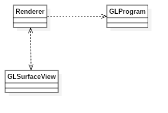
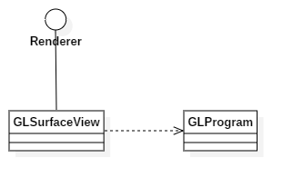

# OpenGLES渲染YUV数据


## 概述

Android通过OpenGLES来显示YUV数据，这样做的原因是：

1. Android本身不能直接显示YUV图像，YUV需要转成RGB再进行渲染。
2. YUV手动转换成RGB会占用大量的CPU，尽量让GPU来做这件事。
3. OpenGLES是Android集成到自身框架里的第三方库，它有很多的可取之处。 

使用OpenGLES渲染YUV数据有两种方式：`GLSurfaceView`和`TextureView`，下面详细介绍这两种方式的使用步骤。

## GLSurfaceView

使用GLSurfaceView渲染YUV数据涉及到三个组件，分别是：

1. GLProgram：负责生成YUV数据，并且封装了一系列native层的opengl方法。
2. GLSurfaceView：显示贴图的控件。
3. Renderer：负责将GLProgram生成的YUV数据贴到GLSurfaceView上。

在开始实现渲染功能之前，首先判断一下手机是否支持OpenGLES2.0（一般的手机均会支持）：

```java
public static boolean detectOpenGLES20(Context context) {  
    ActivityManager am = (ActivityManager) context.getSystemService(Context.ACTIVITY_SERVICE);  
    ConfigurationInfo info = am.getDeviceConfigurationInfo();  
    return (info.reqGlEsVersion >= 0x20000);  
}
```

### 各组件之间的关系

实现渲染功能，首先需要确定各个组件之间的依赖关系，从而设计出较为完善的渲染模型。上一章节提到了GLSurfaceView、Renderer、GLProgram三大组件，Renderer作为渲染的中枢，持有GLSurfaceView、GLProgram，而GLSurfaceView为了显示贴图，也需要使用Renderer。因此它们之间的UML类图如下所示：



正常情况下，外部调用者只想使用GLSurfaceView来渲染数据。上述设计的缺陷在于，外部调用者必须知道Renderer的存在，在外部创建Renderer并手动设置给GLSurfaceView，使用较为复杂。并且由外部调用者控制setRenderer的时机是一种危险行为：

> 当GLSurfaceView处于可见状态时，会触发GLSurfaceView.surfaceCreated()，此时GLThread必须已经存在并处于运行状态，并相应调用Renderer.onSurfaceCreated();如果GLThread不存在（setRenderer()还没有被调用），就会引起崩溃；一个保险的做法是创建GLSurfaceView后先调用getHolder().removeCallback(this)，然后在setRenderer()之后再重新调用getHolder().addCallback()来规避上述情况发生。当然，如果在触发GLSurfaceView.surfaceCreated()前已经调用过setRenderer()，上述情况不会发生。 

Renderer本质上是GLSurfaceView内部定义的接口，为了提升GLSurfaceView的内聚性，简化外部调用者的使用流程，可以直接定义子类继承GLSurfaceView并实现Renderer接口。由GLSurfaceView内部决定setRenderer的时机（通常在构造方法中），避免上述的崩溃问题。优化后的UML类图如下所示：



### Renderer

从本章节开始正式介绍各组件的实现代码。实现Renderer接口需要实现三个抽象方法：

- onSurfaceCreated()：在创建surface时需要做的初始化工作；通常在该GLSurfaceView的生命周期只需要做一次。

- onSurfaceChanged()：当宿主view的大小等状态发生变化引起GLSurfaceView自身的大小变化，或者我们人为改变GLSurfaceView的大小时，该方法会被调用；最常见的一个做法是，我们在这个方法里最起码地会根据GLSurfaceView的新的大小，调用glViewport()将viewport大小设置为与GLSurfaceView大小一致；

- onDrawFrame()：GLSurfaceView可以工作在不同的RenderMode：WHEN_DIRTY和CONTINUOUSLY（参见setRenderMode()）；如果是WHEN_DIRTY,该方法可以由GLSurfaceView.requestRender()引发，或者onSurfaceChanged()引发；如果是CONTINUOUSLY，GLSurfaceView按照屏幕的刷新频率自动触发该方法；在该方法里，我们做一次绘图。

  绘图时所需的program在GLSurfaceView的生命周期可能一直不变（这样的话只需要在onSurfaceCreated()中创建OpenGL的program(参见glCreateProgram())）,也可能随设置的不同而改变；一种做法是当需要改变时在onDrawFrame()中删除老的program(参见glDeleteProgram())，创建并应用新的program，也可以在其它地方（但需要属于同一个GLThread）创建新的program，在onDrawFrame()中使用（参见gUseProgram()）;

  以上方法都运行在setRender()时创建的GLThread中；GLThread也实现了工作thread与surface，program的绑定；

代码如下：

```java
public class GLRenderView extends GLSurfaceView implements GLSurfaceView.Renderer {
	// ……省略GLSurfaceView相关代码
    private GLProgram mGLProgram;
	@Override
	public void onSurfaceCreated(GL10 gl10, EGLConfig eglConfig) {
	    synchronized (mLock) {
	    	/* surface重建，glprogram也需要重建 */
	        if (mGLProgram != null) {
	            buildProgram(false);
	        }
	    }
	}	
	@Override
	public void onSurfaceChanged(GL10 gl, int width, int height) {
	    synchronized (mLock) {
	        mScreenWidth = width;
	        mScreenHeight = height;
	        JNIGLProgram.setViewPort(0, 0, width, height);
	        if (mGLProgram != null) {
	            mGLProgram.setScreenRatio((float) mScreenHeight / mScreenWidth);
	        }
	    }
	}	
	@Override
	public void onDrawFrame(GL10 gl10) {
	    int drawFrameResult;
	    synchronized (mLock) {
	        if (mGLProgram == null) {
	            createProgram(mFrame.format);
	            // 防止创建失败，仍然判断一次
	            if (mGLProgram != null) {
	                buildProgram(true);
	            } else {
	                return;
	            }
	        }	
	        if (mNeedUpdateShaderProgramOption) {
	            buildProgram(true);
	        }	
	        // 若未创建纹理或获得新的frame，则创建纹理
	        if (!mGLProgram.hasTextureBuilt() || !mFrameHasBuiltTexture) {
	            TPLog.d(TAG, "buildTexture, width = " + mFrame.width + ", height = " + mFrame.height);
	            mGLProgram.buildTextures(mFrame);
	            if (!mFrameHasBuiltTexture) {
	                mFrameHasBuiltTexture = true;
	            }
	        }
	        drawFrameResult = mGLProgram.drawFrame();
	        if ((drawFrameResult == GLProgram.TPPLAYER_GL_DRAW_FRAME_EC_CRUISE
	                || drawFrameResult == GLProgram.TPPLAYER_GL_DRAW_FRAME_EC_TRANSITION_ANIMATION
	                || drawFrameResult == GLProgram.TPPLAYER_GL_DRAW_FRAME_EC_INERTIA)
	                && !mStopAnimation) {
	            requestRender();
	        }	
	        startDisplay();
	    }
	}
}
```


