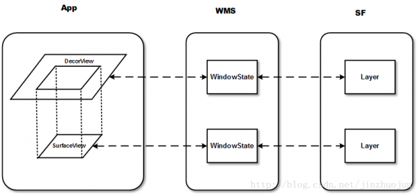
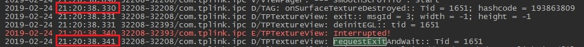

# Android OpenGLES渲染视频帧

| 版本/状态 | 责任人 | 起止日期  | 备注     |
| --------- | ------ | --------- | -------- |
| V1.0/草稿 | 蔡政和 | 2018/2/24 | 创建文档 |

[TOC]

## 前言

Android通过OpenGLES来显示YUV数据，这样做的原因是：

1. Android本身不能直接显示YUV图像，YUV需要转成RGB再进行渲染。
2. YUV手动转换成RGB会占用大量的CPU，尽量让GPU来做这件事。
3. OpenGLES是Android集成到自身框架里的第三方库，有很多可取之处。 

使用OpenGLES渲染YUV数据通常包含两种方式：`GLSurfaceView`和`TextureView`，下面将详细介绍这两种方式的使用方式。

## 概念介绍

### SurfaceView

SurfaceView在Android 1.0(API level 1)  中引入。它继承自类View。与普通View不同的是，它有自己的Surface。通常在Activity的View树中，只有DecorView才是对WMS可见的，它在WMS中有1个对应的WindowState，同时在SF中有1个对应的Layer。而SurfaceView自带1个Surface，这个Surface在WMS中有自己对应的WindowState，在SF中也会有自己的Layer。如下图所示： 



在App端，SurfaceView仍在View hierachy中，但在Server端（WMS和SF）中，它与宿主窗口是分离的。这样的好处是对这个Surface的渲染可以放到单独线程去做，渲染时可以有自己的GL context。对一些游戏、视频等性能相关的应用非常有益。但它也有缺点，由于这个Surface不在View hierachy中，它的显示也不受View的属性控制，所以不能进行平移，缩放等变换，也不能放在其它ViewGroup中，无法使用一些View的特性。 

### GLSurfaceView

GLSurfaceView在Android  1.5(API level  3)中引入，作为SurfaceView的补充。GLSurfaceView在SurfaceView的基础上加入了EGL的管理，并自带渲染线程。另外它定义了用户需要实现的Render接口（Strategy   pattern）。使用方法如下：

```java
public class MyActivity extends Activity {     
	protected void onCreate(Bundle savedInstanceState) {         
		mGLView = new GLSurfaceView(this);         
		mGLView.setRenderer(new RendererImpl(this));
	}
}
```

GLSurfaceView和SurfaceView的类图如下所示：


其中SurfaceView的SurfaceHolder主要是提供了一系列操作Surface的接口。GLSurfaceView中的EglHelper和GLThread分别实现了管理EGL环境和渲染线程的工作。GLSurfaceView的使用者需要实现Renderer接口。

### SurfaceTexture

SurfaceTexture在Android 3.0(API level  11)中引入。和SurfaceView不同的是，它对图象流的处理不直接显示，而是转为GL外部纹理，因此可用于图象流数据的2次处理（如Camera滤镜，桌面殊效等）。比如Camera的预览数据，变成纹理后可以交给GLSurfaceView直接显示，也能够通过SurfaceTexture交给TextureView作为View heirachy中的1个硬件加速层来显示。

SurfaceTexture从图象流（来自Camera预览，视频解码，GL绘制场景等）中取得帧数据，当调用updateTexImage()时，根据内容流中最近的图像更新SurfaceTexture对应的GL纹理对象，接下来，就能够像操作普通GL纹理一样操作它了。 

### TextureView

TextureView在4.0(API level 14)中引入。它可以将内容流直接投影到View中，可以用于实现Live、preview等功能。和SurfaceView不同，它不会在WMS中单独创建窗口，而是作为View hierachy中的一个普通View，因此可以和其它普通View一样进行移动，旋转，缩放，动画等变化。值得注意的是TextureView必须在硬件加速的窗口中。

TextureView继承自View，重载了draw()方法，将SurfaceTexture中收到的图象数据作为纹理更新到对应的HardwareLayer中。SurfaceTextureListener接口用于让TextureView的使用者知道SurfaceTexture已准备好，这样就能够把SurfaceTexture交给相应的内容源。 

### 总结

最后，总结下这几者的区分和联系。

- SurfaceView拥有单独的Surface。可以在子线程渲染。其缺点是不能做变形和动画。
- SurfaceTexture可以用作非直接输出的内容流，这样就提供2次处理的机会。与SurfaceView直接输出相比，这样会有若干帧的延迟。同时，由于它本身管理BufferQueue，因此内存消耗也会略微大一些。
- TextureView可以把内容流作为外部纹理输出。本身需要一个硬件加速层。事实上TextureView本身也包括了SurfaceTexture。它与SurfaceView+SurfaceTexture组合相比可以完成类似的功能（即把内容流上的图象转成纹理，然后输出）。两者的区别是：
  - TextureView在View hierachy中绘制，因此一般在主线程工作（Android  5.0引入渲染线程后，在渲染线程工作）。
  - 而SurfaceView+SurfaceTexture在单独的Surface上绘制，可以是用户提供的线程，而不是系统的主线程或是渲染线程。另外，与TextureView相比，它还有个好处是可以用Hardware overlay进行显示。 

## GLProgram

GLProgram是项目封装的OpenGL ES工具类，用于将YUV转换成RGB数据（Shader），并将纹理贴到绑定的View上。本文档不介绍GLProgram内部具体的方法。详情请查看：

《RenderComponent设计文档.doc》

《OpenGL基本概念和使用.pptx》

## GLSurfaceView

在开始实现渲染功能之前，首先判断手机是否支持OpenGLES2.0（一般的手机均会支持）：

```java
public static boolean detectOpenGLES20(Context context) {  
    ActivityManager am = (ActivityManager) context.getSystemService(Context.ACTIVITY_SERVICE);  
    ConfigurationInfo info = am.getDeviceConfigurationInfo();  
    return (info.reqGlEsVersion >= 0x20000);  
}
```

### 各组件之间的关系

使用GLSurfaceView渲染YUV数据涉及到三个组件，分别是：

1. GLSurfaceView：显示贴图的控件。
2. Renderer：提供对GLSurfaceView状态的监听，当Surface创建、改变或绘制Frame时，由外部调用者实现自定义操作。
3. GLProgram：OpenGL工具类，负责将视频帧转换成纹理（Shader）并贴到GLSurfaceView上。

当GLSurfaceView处于可见状态时，会触发GLSurfaceView.surfaceCreated()，此时GLThread必须已经存在并处于运行状态，并相应调用Renderer.onSurfaceCreated()；如果GLThread不存在（setRenderer()还没有被调用），就会引起崩溃。

为了提升GLSurfaceView的内聚性，简化外部调用者的使用流程，可以直接定义子类**TPGLRenderView**继承GLSurfaceView并实现Renderer接口。由TPGLRenderView内部决定setRenderer的时机（通常在构造方法中），避免上述的崩溃问题。优化后的UML类图如下所示：


> 如果不确定setRenderer的时机，有一种保险的做法是创建GLSurfaceView后先调用getHolder().removeCallback(this)，然后在setRenderer()之后再重新调用getHolder().addCallback()来避免崩溃。当然，如果在触发GLSurfaceView.surfaceCreated()前已经调用过setRenderer()，上述情况不会发生。

### Renderer

上文提及，需要将已实现的Renderer接口设置给GLSurfaceView，Renderer接口如下：

- onSurfaceCreated()：在创建surface时需要做的初始化工作；通常在该GLSurfaceView的生命周期只需要做一次。

- onSurfaceChanged()：当宿主view的大小等状态发生变化引起GLSurfaceView自身的大小变化，或者我们人为改变GLSurfaceView的大小时，该方法会被调用；最常见的一个做法是，我们在这个方法里最起码地会根据GLSurfaceView的新的大小，调用glViewport()将viewport大小设置为与GLSurfaceView大小一致；

- onDrawFrame()：GLSurfaceView可以工作在不同的RenderMode：WHEN_DIRTY和CONTINUOUSLY（参见setRenderMode()）；如果是WHEN_DIRTY,该方法可以由GLSurfaceView.requestRender()引发，或者onSurfaceChanged()引发；如果是CONTINUOUSLY，GLSurfaceView按照屏幕的刷新频率自动触发该方法；在该方法里，我们做一次绘图。

  绘图时所需的program在GLSurfaceView的生命周期可能一直不变（这样的话只需要在onSurfaceCreated()中创建OpenGL的program(参见glCreateProgram())）,也可能随设置的不同而改变；一种做法是当需要改变时在onDrawFrame()中删除老的program(参见glDeleteProgram())，创建并应用新的program，也可以在其它地方（但需要属于同一个GLThread）创建新的program，在onDrawFrame()中使用（参见gUseProgram()）;

  以上方法都运行在setRender()时创建的GLThread中；GLThread也实现了工作thread与surface，program的绑定；

核心代码如下：

```java
public class TPGLRenderView extends GLSurfaceView implements GLSurfaceView.Renderer {
    private TPGLRenderer mGLRenderer;
	@Override
    public void onSurfaceCreated(GL10 gl10, EGLConfig eglConfig) {
        synchronized (mLock) {
            mGLRenderer.onSurfaceCreated();
        }
    }

    @Override
    public void onSurfaceChanged(GL10 gl, int width, int height) {
        synchronized (mLock) {
            mGLRenderer.onSurfaceChanged(width, height);
        }
    }

    @Override
    public void onDrawFrame(GL10 gl10) {
        synchronized (mLock) {
            if (mGLRenderer.onDraw(mFrame, mIsNewFrame)) {
                requestRender();
            }
            if (mIsNewFrame) {
                mIsNewFrame = false;
            }
            startDisplay();
        }
    }
```

考虑到后续还要使用TextureView渲染数据，因此将创建、调用GLProgram的相关流程封装在TPGLRenderer.java文件中，本文档中不再展开介绍。

### 构造方法

构造方法用于初始化各组件并绑定GLSurfaceView和Renderer，代码如下：

```java
public TPGLRenderView(Context context) {
	super(context);
	setRenderer(this);
	setRenderMode(GLSurfaceView.RENDERMODE_WHEN_DIRTY);
	mFrame = new TPAVFrame();
	mIsNewFrame = false;
	mLock = new Object();
	mGLRenderer = new TPGLRenderer();
}
```

可以看到，构造方法的第一行就是将实现的Renderer接口设置给GLSurfaceView，避免引起崩溃。setRenderMode方法用于控制GLSurfaceView渲染的时机，setRenderMode的参数含义如下：

- RENDERMODE_WHEN_DIRTY：当Surface创建或requestRender方法被调用时重绘画面。
- RENDERMODE_CONTINUOUSLY：持续重绘画面，重绘频率与手机屏幕一致。

### renderFrame

renderFrame方法用于传递并渲染一个视频帧，代码如下：

```java
public void renderFrame(TPAVFrame frame) {
	/* 在GLThread线程里会访问mFrame进行渲染，所以这里要加锁避免访问冲突 */
	synchronized (mLock) {
	    mFrame.RefFrom(frame);
	    mIsNewFrame = true;
	    requestRender();
	}
}
```

RefFrom方法用于拷贝一份视频帧数据。该方法在主线程执行，需要加锁，避免拷贝数据时渲染线程访问该帧。拷贝完后调用requestRender方法通知GLSurfaceView重新绘制。

### 外部调用

TPGLRenderView内部已经实现了Renderer接口，对于外部调用者来说，只需做以下几个步骤：

1. 创建TPGLRenderView。
2. 设置播放参数DisplayInfo、ScaleMode和DisplayMode。
3. 传递视频帧数据。
4. 开始播放。

示例代码如下：

```java
TPGLRenderView mGLView = new TPGLRenderView(getActivity());
TPDisplayInfoFishEye displayInfo = new TPDisplayInfoFishEye(
        mDevice.isFishEyeCircle(),
        mDevice.isFishEyeCenterCalibration(),
        mDevice.getFishEyeInvalidPixelRatio(),
        mDevice.getFishEyeCirlceCenterX(),
        mDevice.getFishEyeCircleCenterY(),
        mDevice.getFishEyeRadius());
mGLView.setDisplayInfo(displayInfo);
mGLView.setScaleMode(TPPlayerCommon.TPPLAYER_DISPLAY_SCALE_MODE_FILL);
mGLView.renderFrame(mTPAVFrame);
mGLView.setDisplayMode(TPPlayerCommon.TPPLAYER_DISPLAY_MODE_FISHEYE_LONGITUDE);
mGLView.start();
```

### 缺陷

GLSurfaceView内部实现简单，外部调用方便，但是它也有不足之处：将GLSurfaceView放入RecyclerView中，会发现列表的滑动非常卡顿。主要有以下两方面的因素：

1. 线程：VIew滑出界面后渲染线程将被销毁，此时主线程会阻塞的等待渲染线程销毁后再继续执行，导致UI卡顿。关于这一点的详细分析请查看TextureView的**结束线程**章节。

2. SurfaceView内部实现问题：将SurfaceView放入RecyclerView中，不渲染任何画面，滑动列表时非常卡顿。而GLSurfaceView继承了SurfaceView，也有卡顿现象，怀疑是SurfaceView内部实现问题（TODO）。

## TextureView

从实现角度看，TextureView包含三大组件：TextureView、SurfaceTextureListener、GLProgram，分别对应GLSurfaceView的GLSurfaceView、Renderer、GLProgram，两者组件关系基本类同，不再赘述。需要注意的是TextureView内部没有封装渲染Thread，需要手动封装。

### SurfaceTextureListener

SurfaceTextureListener接口的抽象方法如下：

- onSurfaceTextureAvailable()：准备好SurfaceTexture时回调该方法，此时可以将SurfaceTexture送给内容源（EGL）使用。TextureView每次从后台到前台时均会调用该方法。
- onSurfaceTextureSizeChanged()：SurfaceTexture的缓冲大小改变时回调该方法。
- onSurfaceTextureDestroyed()：SurfaceTexture将要被销毁时回调该方法。若返回值为true，则后续不允许再对该SurfaceTexture做渲染操作；若返回值为false，需要再手动调用release方法释放SurfaceTexture。通常直接返回true即可。TextureView每次从前台转到后台时（onDetachedFromWindow）均会调用该方法。
- onSurfaceTextureUpdated()：通过updateTexImage()方法更新指定的SurfaceTexture时回调该方法。

代码如下：

```java
@Override
public void onSurfaceTextureAvailable(SurfaceTexture surface, int width, int height) {
    startGLThread(width, height);
}
@Override
public void onSurfaceTextureSizeChanged(SurfaceTexture surface, int width, int height) {
    if (mGLThread != null) {
        mGLThread.exec(GLThread.MSG_WHAT_CHANGE_SURFACE, width, height);
    }
}
@Override
public boolean onSurfaceTextureDestroyed(SurfaceTexture surface) {
    if (mGLThread != null) {
        mGLThread.exec(GLThread.MSG_WHAT_DESTROY);
        mGLThread = null;
    }
    return true;
}
@Override
public void onSurfaceTextureUpdated(SurfaceTexture surface) {
}
```

可以看到在onSurfaceTextureAvailable方法中启动了渲染线程，在onSurfaceTextureDestroyed方法中销毁了渲染线程，确保渲染线程的生命周期与SurfaceTexture保持同步。启动线程的代码如下：

```java
private void startGLThread(int surfaceWidth, int surfaceHeight) {
    if (mGLThread != null && !mGLThread.isInterrupted()) {
        return;
    }
    /**在子线程中进行绘制工作*/
    mGLThread = new GLThread(getSurfaceTexture(), surfaceWidth, surfaceHeight);
    mGLThread.start();
}
```

如果渲染线程已经存在，不再重复创建。将SurfaceTexture以及宽高信息传入GLThread，在渲染线程中配置EGL环境并将SurfaceTexure交付给内容源。

### GLThread

#### run

TextureView没有自带渲染线程，需要我们手动定义线程GLThread。上文已经提及，GLThread的生命周期与SurfaceTexture保持一致，因此它的run方法中需要使用while循环，保证线程不自动退出：

```java
public void run() {
    try {
        while (!Thread.interrupted()) {
            synchronized (mLock) {
                if (handleMessages(mGLMessage)) {
                    continue;
                }
                mLock.wait();
            }
        }
    } catch (InterruptedException e) {
        Log.e(TAG, "Interrupted!");
    } finally {
        synchronized (mLock) {
            mExited = true;
            mLock.notifyAll();
        }
    }
}
```

`try-catch`+`while(!Thread.interrupted())`是线程的常规用法，在发出interrupt()请求后，前者确保线程在阻塞状态下捕获异常，及时退出；后者确保线程在运行状态下判断interrupted()为true，正常退出。

为了减小CPU的开销，调用wait()方法将渲染线程挂起，只有收到渲染请求时才唤醒线程。在上述写法中，创建线程后的第一次循环会多调用一次handleMessages，但由于此时的GLMessage为INVALID状态，所以不会做任何操作，直接挂起线程。

#### 构造线程

在GLThread的构造方法中会将SurfaceTexture绑定到EGL，并执行一次渲染操作，代码如下：

```java
public GLThread(SurfaceTexture surfaceTexture, int width, int height) {
    this.mSurfaceTexture = surfaceTexture;
    exec(MSG_WHAT_CREATE, width, height);
}
```

exec()方法的实现将在**消息传递机制**章节详细介绍。

#### 结束线程

GLThread提供了两种结束线程的方式：`exec(GLThread.MSG_WHAT_DESTROY)`和`requestExitAndWait()`。前者是异步结束线程，不关心线程的结果；后者则是阻塞的等待线程结束。

假如在UI线程调用了`requestExitAndWait()`，UI将阻塞的等待渲染线程结束。当渲染线程将要结束时，run方法的finally代码块中会将mExited变量置为true，并唤醒主线程。requestExitAndWait代码如下：

```java
public void requestExitAndWait() {
    synchronized (mLock) {
        exec(GLThread.MSG_WHAT_DESTROY);
        while (!mExited) {
            try {
                mLock.wait();
            } catch (InterruptedException ex) {
                Thread.currentThread().interrupt();
            }
        }
    }
}
```

通常在两个时机结束渲染线程：GLThread的finalize()方法和TexutreView的onSurfaceTextureDestroyed()回调。与GLSurfaceView中结束线程的时机保持一致。

#### 性能检测

针对UI线程阻塞等待渲染线程结束的方式，在Demo中进行耗时检测，日志如下：



UI线程挂起的时间时0.330s，唤醒的时间是0.341s，阻塞了0.011s，即11ms。这只是一个View的阻塞时间，若列表中一行有三个View，滑动一行就会阻塞33ms，滑动三行就会阻塞99ms，还是很容易被用户感知到的。

### 消息传递机制

使用TextureView时，通常会在UI线程发起请求，在渲染线程执行对应的操作。如何将请求切换至GLThread执行呢？这里采用GLMessage+notify的方式将请求切换至渲染线程执行。下面以绘制一帧为例：

1. 外部调用者在UI线程调用renderFrame方法，最终执行到GLThread的exec()方法，代码如下：

   ```java
   public void exec(int msgId, int width, int height) {
       synchronized (mLock) {
           mGLMessage.what = msgId;
           mGLMessage.arg1 = width;
           mGLMessage.arg2 = height;
           mLock.notifyAll();
       }
   }
   ```

   该方法中会对GLMessage赋值，其中what表示消息类型，arg1和arg2则是对应消息的相关参数。赋值完毕后调用notifyAll方法唤醒渲染线程。

2. 渲染线程唤醒后执行handleMessages()方法，代码如下：

   ```java
   private boolean handleMessages(Message msg) throws InterruptedException {
       boolean drawFrame = false;
       switch (msg.what) {
           case MSG_WHAT_CREATE:
               mEglHelper = new EGLHelper();
               mEglHelper.setSurfaceType(EGLHelper.EGLHELPER_SURFACE_TYPE_WINDOW, mSurfaceTexture);
               mEglHelper.initEgl(msg.arg1, msg.arg2);
               mGLRenderer.onSurfaceCreated();
               mGLRenderer.onSurfaceChanged(msg.arg1, msg.arg2);
               drawFrame = true;
               break;
           case MSG_WHAT_CHANGE_SURFACE:
               mGLRenderer.onSurfaceChanged(msg.arg1, msg.arg2);
               drawFrame = true;
               break;
           case MSG_WHAT_DRAW_FRAME:
               drawFrame = mGLRenderer.onDraw(mFrame, mIsNewFrame);
               if (mIsNewFrame) {
                   mIsNewFrame = false;
               }
               mEglHelper.swapBuffers();
               break;
           case MSG_WHAT_DESTROY:
               mEglHelper.deinitEgl();
               throw new InterruptedException();
           case MSG_WHAT_INVALID:
           default:
               // ignore
               break;
       }
       msg.what = MSG_WHAT_INVALID;
       if (drawFrame)
           exec(MSG_WHAT_DRAW_FRAME);
       return drawFrame;
   }
   ```

   在该方法中处理所有类型的消息，包括：

   - MSG_WHAT_CREATE：配置EGL环境，创建GLProgram，绑定SurfaceTexture和EGL。在创建线程时（onSurfaceTextureAvailable）发起。
   - MSG_WHAT_CHANGE_SURFACE：更新GLProgram，在SurfaceTexture更新时（onSurfaceTextureSizeChanged）发起。
   - MSG_WHAT_DRAW_FRAME：绘制一帧。在调用requestRender时发起。
   - MSG_WHAT_DESTROY：注销EGL环境，在结束线程时发起。
   - MSG_WHAT_INVALID：无效消息，每次执行完消息后均将消息置为无效消息，避免渲染线程因为异常原因被唤醒后做出额外的操作。

   上述有两个细节值得注意：

   1. `drawFrame`：该变量用于控制执行完当前消息后，渲染线程是否挂起。若为true，则不挂起，继续绘制下一帧；若为false，则将线程挂起。
   2. destroy消息的处理机制：在收到该消息时，并没有调用interrupt()方法，而是直接抛出了InterruptedException异常。原因是在运行状态下，interrupt()方法只能将interrupt标记位置为true，不能直接退出线程。执行完该方法后，还未判断interrupt标记位，线程就会执行wait挂起，永远无法退出。因此抛出异常才能够退出渲染线程。

### 问题记录

在实现TextureView的过程当中遇到了一些问题，在此记录一下：

#### TextureView的内存溢出问题

 **崩溃场景**

在XML中定义TextureView，RecyclerView的item均通过XML静态实例化TextureView，上下滑动列表后崩溃，日志提示OOM： 

```
dup() failed in Parcel::read, i is 0, fds[i] is -1, fd_count is 2, error: Too many open files 
```

**分析思路**

1. 内存溢出，直接想法一般是TextureView或者GLThread没有正常释放。但是考虑到RecyclerView的机制，TextureView会不断被复用，排除TextureView溢出的可能。

2. 每次item移出界面时，强制GC，都会执行GLThread的finalize方法，意味着与TextureView绑定的GLThread被正常销毁，排除线程溢出的可能。

3. 根据上述两点，推断可能是与线程绑定的GL ES配置没有清空。采用排除法验证该推断，先将GL ES配置的相关代码全部注释，发现不会发生崩溃。 继续缩小范围，最终发现创建和销毁GL配置的代码没有问题，是GL的swapBuffer方法（双缓冲机制）导致崩溃。 

4. 只有调用swapBuffer方法才能使绘图生效，没有其它替代方案，并且该方法属于GL库的内部方法，没有优化空间。问题似乎变得无解。 重新整理思路，在之前的测试过程中已经知道ViewPager+TextureView是不会崩溃的，思考ViewPager和RecyclerView的不同点：ViewPager不会复用TextureView。

5. 改变RecyclerView中使用TextureView的方式，每个Item都动态实例化TextureView，放弃使用RecyclerView的复用机制。此时滑动列表不再崩溃，并且item每次移出界面时，强制GC，都会执行TextureView的finalize方法，说明TextureView能够正常销毁，没有内存泄露发生。 

6. 问题到此算是解决了，回过头来看这个问题，怀疑TextureView不能重复和多个不同的Thread绑定，否则容易造成fd不足（TODO）。

**解决方案** 

调整RecyclerView使用TextureView的方式，动态实例化TextureView，放弃自身的布局复用机制。

## 小结

上文量化比较了TextureView和GLSurfaceView在列表中的表现，在滑动的列表中，TextureView不会出现卡顿问题，而GLSurfaceView的卡顿现象比较严重。从线程角度分析，TextureView采用异步结束线程的方式，而GLSurfaceView则是同步结束线程。在**性能检测**章节也对两者的差异进行了量化分析。同时TextureView作为一个普通View，支持变形和缩放，适用范围更广，因此在列表+播放器的场景下推荐使用TextureView来渲染YUV数据。

## 参考文献

[SurfaceView、TextureView、SurfaceView和GLSurfaceView](http://www.wfuyu.com/technology/22762.html)

[TextureView+OpenGL ES播放视频（二）](https://www.jianshu.com/p/b2d949ab1a1a)