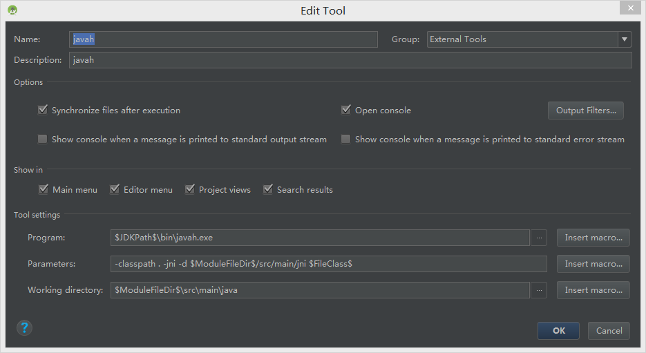

# JNI

| author     | date       | history                |
| ---------- | ---------- | ---------------------- |
| caizhenghe | 2018-10-25 | create doc             |
| caizhenghe | 2018-11-04 | add android.mk chapter |

[TOC]

## JNI开发流程

## Application.mk书写规则

## Android.mk书写规则

```makefile
# 定义Android.mk文件的路径
LOCAL_PATH := $(call my-dir)

#定义本地源文件目录
SRC_APP_DIR := ../../../../../..

# 清空本地变量
include $(CLEAR_VARS)
# 输出的模块名称
LOCAL_MODULE := avcodec
# 指定源码文件
LOCAL_SRC_FILES := $(LOCAL_PATH)/$(SRC_APP_DIR)/ffmpeg/libavcodec-57.so
# 预编译动态库（.so）
include $(PREBUILT_SHARED_LIBRARY)

# 清空本地变量
include $(CLEAR_VARS)
LOCAL_MODULE := crypto
# 如果目标平台是armeavi-v7a，则编译以下源码
ifeq ($(strip $(TARGET_ARCH_ABI)),armeabi-v7a)
# 指定源文件
LOCAL_SRC_FILES := $(SRC_APP_DIR)/tpnclient/openssl_android/armeabi-v7a/lib/libcrypto.a
# 指定头文件
LOCAL_EXPORT_C_INCLUDES := $(SRC_APP_DIR)/tpnclient/openssl_android/armeabi-v7a/include/openssl
endif
# 预编译静态库（.a）
include $(PREBUILT_STATIC_LIBRARY)

# 清空本地变量
include $(CLEAR_VARS)
LOCAL_MODULE := Test
# 指定头文件
LOCAL_C_INCLUDES := \
                    $(LOCAL_PATH)/$(SRC_APP_DIR)/ \
                    $(LOCAL_PATH)/$(SRC_APP_DIR)/src/AndroidJNI \
# 使用wildcard函数将jni目录下的所有后缀为.cpp和.c的文件放到MY_CPP_LIST变量中
MY_CPP_LIST := $(wildcard $(LOCAL_PATH)/*.cpp)
MY_CPP_LIST += $(wildcard $(LOCAL_PATH)/*.c)
# 添加一个源文件到MY_CPP_LIST变量中
MY_CPP_LIST += $(LOCAL_PATH)/$(SRC_APP_DIR)/src/Test.cpp
# 指定源文件，并且将MY_CPP_LIST中的所有源文件均去掉前面的路径部分。
LOCAL_SRC_FILES := $(MY_CPP_LIST:$(LOCAL_PATH)/%=%)
# 添加TEST的宏定义
LOCAL_CFLAGS += -DTEST
# 支持RTTI
LOCAL_CPPFLAGS += -frtti
# 添加gcc依赖库（libz、libdl、math、log）
LOCAL_LDLIBS := -lz -ldl -lm -llog
# 添加本地静态库依赖
LOCAL_STATIC_LIBRARIES := crypto
# 添加本地动态库依赖
LOCAL_SHARED_LIBRARIES := avcodec
# 添加所有support动态库
LOCAL_WHOLE_STATIC_LIBRARIES += android_support
# 编译动态库
include $(BUILD_SHARED_LIBRARY)
```

- LOCAL_EXPORT_C_INCLUDES和LOCAL_C_INCLUDES的区别：如果A模块依赖了B模块的头文件，此时若A模块不被模块C使用，可以用LOCAL_SRC_FILES；若A会被C使用，则要使用LOCAL_EXPORT_C_INCLUDES，目的是将A的头文件自动导入C中。

- 路径批量替换也可以使用substr函数来实现：

  ```makefile
  LOCAL_SRC_FILES := $(subst $(LOCAL_PATH)/, , $(MY_CPP_LIST))
  ```

## javah命令配置

在AS中使用javah添加自动生成JNI头文件的工具：

1. 进入Settings->Tools->External Tools，添加工具
2. Program填写javah运行程序的路径：\$JDKPath\$\bin\javah.exe
3. Parameters填写命令参数：-classpath . -jni -d \$ModuleFileDir\$/src/main/jni \$FileClass\$
4. Working directory填写作用范围：\$ModuleFileDir\$\src\main\java

具体配置如下图所示：



## 成员变量描述符

## 全局变量和局部变量

## 变量类型转换

### java->native

### native->java

## 反射调用java接口