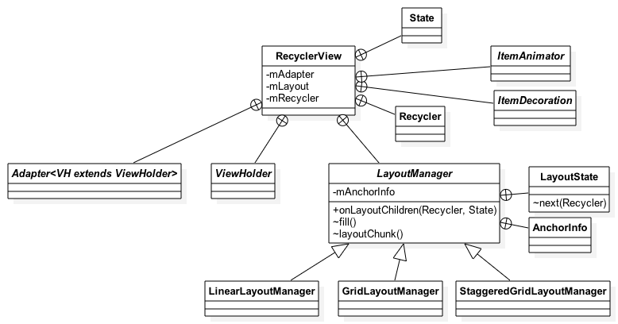
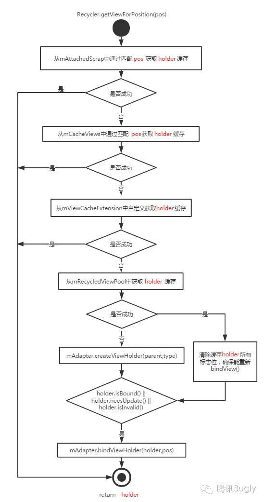

# RecyclerView源码解析

| author     | date       | history    |
| ---------- | ---------- | ---------- |
| caizhenghe | 2018-11-10 | create doc |

[TOC]

## 基础使用方法

### 继承并实现抽象类Adapter

**onCreateViewHolder**

onCreateViewHodler方法用于绑定View和ViewHolder，可以使用LayoutInflater将xml布局转换成View。LayouInflater的from(int resource, ViewGroup root, boolean attachToRoot)方法用法如下：

- root为null：不将View添加到父View中，子View最外层属性不会生效。
- root不为null，attachRoot为false：不将View添加到父View中，子View最外层属性会生效。
- root不为null，attachRoot为true：将View添加到父View中，子View最外层属性会生效。

**onBindViewHolder**

onBindViewHolder用于绑定View和Data，通过Data设置View的各项属性。

### 调整Item布局大小

1. 将item最外层布局设置成wrap_content，根据内容自动适配大小。
2. 对于纵向滑动的GridLayoutManager，需要将Item的宽度设置成match_parent，避免RecyclerView布局异常（若item中的子View没有设置最小宽度，将导致布局异常）。
3. 在Adapter的onCreateViewHolder中动态修改item的大小。
4. 重写LayoutManager的generateDefaultLayoutParams()方法修改item大小。(FIXME)

### 分割线

TODO

使用DividerItemDecoration实现列表的分割线效果。

### 点击事件

TODO

### 点击动画效果

TODO

## 源码分析

### 概述

RecyclerView的设计体现出高内聚，低耦合的思想。高内聚体现在它将关系紧密的功能定义成内部类，比如Adapter、ViewHolder（而在ListView中开发者需要自定义ViewHolder，并且这不是一种强制操作）；低耦合体现在RecyclerView自身只通过Recycler回收和复用布局，其余的功能都交给抽象内部类处理，拔插式设计（策略模式）。各个模块的分工如下：

- Adapter：用于绑定itemView与数据。
- ViewHolder：用于保存某个position的itemView以及元数据信息。
- LayoutManager：负责布局的绘制。官方实现有：LinearLayoutManager、GridLayoutManager、StaggeredGridLayoutManager。
- Recycler：负责回收和复用布局。
- ItemDecoration：增加一些特殊布局，比如分隔线。
- ItemAnimator：实现Item动画。

下图为RecycerView简易架构UML类图：

### RecyclerVIew

**绘制流程**

- RecyclerView的onMeasure方法执行dispatchLayoutStep2方法，该方法内执行了LayoutManager的onLayoutChildren方法绘制Item。
- RecyclerView的onLayout方法执行dispatchLayoutStep3，实现Item的动画效果。

**缓存机制**

交付给内部类Recycler回收和复用布局。

### LayoutManager

从上图可以看到，LayoutManager的onLayoutChildren方法实现了Item的绘制。绘制时引入锚点的概念（AnchorInfo）：从锚点位置先向下绘制，再向上绘制，最终绘制剩下的部分。每次绘制均会调用fill方法，在fill方法中调用layoutChunk方法。在layoutChunk方法中调用LayoutState的next方法，next方法中会调用getViewForPositon方法，通过Recycler获取合适的View。getViewForPositon的源码注释如下：

> Attempts to get the ViewHolder for the given position, either from the Recycler scrap, cache, the RecycledViewPool, or creating it directly.

获取View后，再经过一系列的Measure和Layout操作就将Item绘制到了UI上。

### Recycler

Recycler有四级缓存：mAttachedScrap、mCacheViews、mViewCacheExtension、mRecyclerPool，流程图如下所示：

