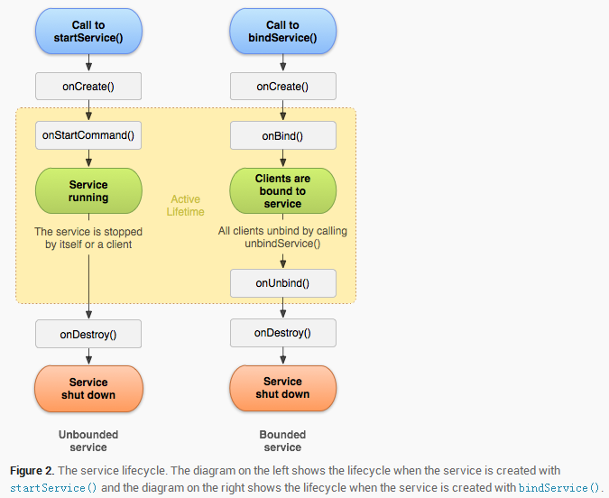

# Service

| 版本/状态 | 责任人 | 起止日期   | 备注            |
| --------- | ------ | ---------- | --------------- |
| V1.0/草稿 | 蔡政和 | 2019-03-20 | 创建Service文档 |

##  

## 生命周期



## 启动方式

### startService

```java
 Intent intent = new Intent(this, MyService.class);
 startService(intent);
```

Service经历如下生命周期：onCreate->onStartCommand->onStart。

多次调用startService，会多次回调onStartCommand和onStart，但onCreate只会执行一次。

启动的Service与其它组件（Activity）的生命周期无关联，即便退出Activity或应用程序，Service依然在后台运行。

若杀死应用所在进程，Service将停止运行（不会调用onDestroy）。

Service自身调用`stopSelf`或者在client中调用`stopService`可以停止Service（此时会调用onDestroy）。

```java
stopService(intent);
```


### bindService

```java
ServiceConnection mConn = new ServiceConnection() {
    @Override
    public void onServiceConnected(ComponentName componentName, IBinder iBinder) {
        Log.d("TAG", "onServiceConnected");
    }

    @Override
    public void onServiceDisconnected(ComponentName componentName) {
        Log.d("TAG", "onServiceDisconnected");
    }
};
Intent intent = new Intent(this, MyService.class);
bindService(intent, mConn, BIND_AUTO_CREATE);
```

Service经历如下生命周期：onCreate->onBind。

多次调用`bindService`只会执行一次onCreate和onBind。

启动的Service与Activity的生命周期相关联，若销毁Activity前没有执行unbindService，将会报出`android.app.ServiceConnectionLeaked`错误， 同时Service会被销毁（执行onUnbind和onDestroy）。

调用`unbindService`可以解绑Service（此时会调用onUnbind、onDestroy）。

```java
unbindService(mConn);
```


### bind+start

当同时执行了bindService和startService时，生命周期可以是：onCreate->onBind->onStartCommand；也可以是：onCreate->onStartCommand->onBind。

只有同时满足unbindService和stopService之后才会销毁Service（执行onDestroy）。