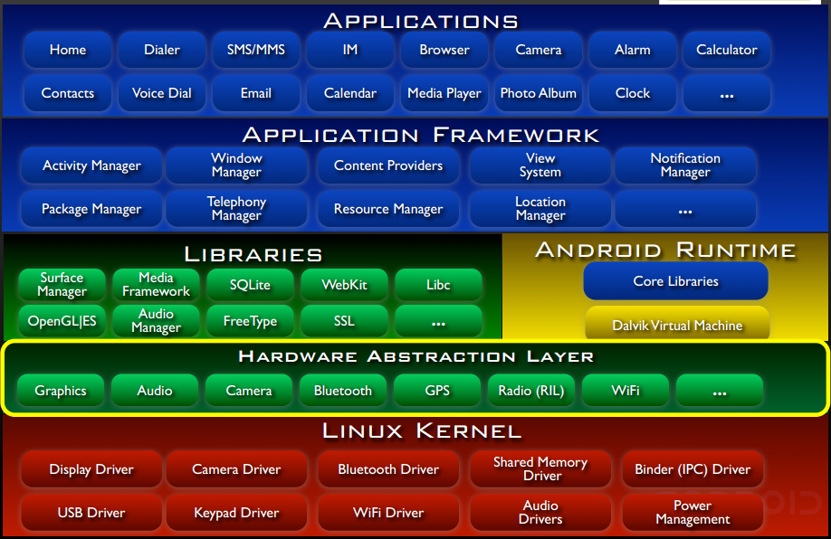
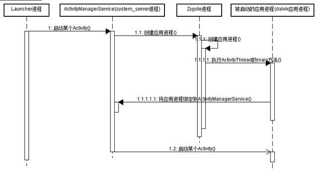
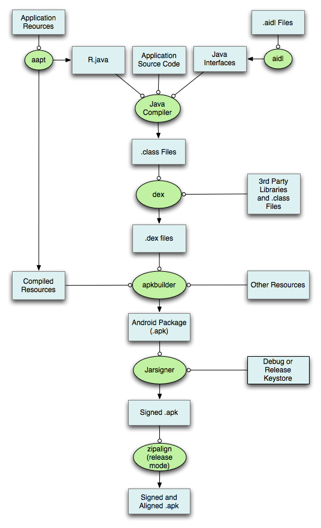

# 疑难杂症

| 版本/状态 | 责任人 | 起止日期   | 备注     |
| --------- | ------ | ---------- | -------- |
| V1.0/草稿 | 蔡政和 | 2019-03-20 | 创建文档 |

##  

## Android架构

## Android系统启动流程

1. bootLoader启动内核和init进程。init进程分裂出很多"daemons"守护进程，比如 android debug deamon,usb deamon.处理底层硬件相关的接口。
2. init进程启动Zygote进程，这个进程初始化第一个VM，预加载framework和众多app通用资源。然后它开启一个socket接口监听请求，一旦收到请求，Zygote会基于自身预加载的VM来孵化新的VM并创建新的进程。
3. 启动Zygote之后，init进程会启动runtime进程，zygote会孵化一个超级管理进程system service.ss会启动所有系统核心服务，例如ams,硬件相关的service等。
4. 启动第一个APP进程，home进程。

## APP启动流程

1. Launcher进程发起请求，并切换至AMS进程。
2. AMS进程发起创建应用进程的请求，并切换至Zygote进程。
3. Zygote进程创建应用进程，并执行ActivityThread的main方法，然后将应用进程绑定到AMS进程。
4. AMS通过ActivityThread启动入口Activity。

## AS Build流程

图中绿色标注为其中用到的相应工具，蓝色代表的是中间生成的各类文件类型。
 **第一步：**打包资源文件，生成R.java文件（使用工具AAPT）
 **第二步：**处理AIDL文件，生成对应的.java文件（没有可以省略，使用工具AIDL）
 **第三步：**编译Java文件，生成对应的.class文件（使用工具Java Compiler）
 **第四步：**把.class文件转化成Davik VM支持的.dex文件（使用工具dex）
 **第五步：**打包生成未签名的.apk文件（使用工具apkbuilder）
 **第六步：**对未签名.apk文件进行签名（使用工具Jarsigner）
 **第七步：**对签名后的.apk文件进行对齐处理，不进行对齐处理不能发布到Google Market（使用工具zipalign）

 

##  Android虚拟机和JVM的区别

主要比较Dalvik VM、ART和JVM三者的区别。

### Dalvik

Dalvik是Google公司自己设计用于Android平台的虚拟机。支持已转换为** .dex格式**的Java应用程序的运行，.dex格式是专为Dalvik设计的一种压缩格式，适合内存和处理器速度有限的系统。
Dalvik 经过优化，允许在有限的内存中同时运行多个虚拟机的实例，并且每一个Dalvik 应用作为一个独立的Linux 进程执行。独立的进程可以防止在虚拟机崩溃的时候所有程序都被关闭。
很长时间以来，Dalvik虚拟机一直被用户指责为拖慢安卓系统运行速度不如IOS的根源。
2014年6月25日，Android L 正式亮相于召开的谷歌I/O大会，Android L 改动幅度较大，谷歌将直接删除Dalvik，代替它的是传闻已久的ART。

###  ART

即Android Runtime
 ART 的机制与 Dalvik 不同。在Dalvik下，应用每次运行的时候，字节码都需要通过即时编译器（just in time ，JIT）转换为机器码，这会拖慢应用的运行效率，而在ART 环境中，应用在第一次安装的时候，字节码就会预先编译成机器码，使其成为真正的本地应用。这个过程叫做预编译（AOT,Ahead-Of-Time）。这样的话，应用的启动(首次)和执行都会变得更加快速。

### ART的优劣

优点：
 1、系统性能的显著提升。
 2、应用启动更快、运行更快、体验更流畅、触感反馈更及时。
 3、更长的电池续航能力。
 4、支持更低的硬件。
 缺点：
 1.机器码占用的存储空间更大，字节码变为机器码之后，可能会增加10%-20%
 2.应用的安装时间会变长

### Dalvik和JVM的区别

Dalvik是基于寄存器的，而JVM是基于栈的。
 Dalvik运行dex文件，而JVM运行java字节码
 自Android 2.2开始，Dalvik支持JIT（just-in-time，即时编译技术）。
 优化后的Dalvik较其他标准虚拟机存在一些不同特性:　
 1.占用更少空间　
 2.为简化翻译，常量池只使用32位索引　　
 3.标准Java字节码实行8位堆栈指令,Dalvik使用16位指令集直接作用于局部变量。局部变量通常来自4位的“虚拟寄存器”区。这样减少了Dalvik的指令计数，提高了翻译速度。　
当Android启动时，Dalvik VM 监视所有的程序（APK），并且创建依存关系树，为每个程序优化代码并存储在Dalvik缓存中。Dalvik第一次加载后会生成Cache文件，以提供下次快速加载，所以第一次会很慢。
Dalvik解释器采用预先算好的Goto地址，每个指令对内存的访问都在64字节边界上对齐。这样可以节省一个指令后进行查表的时间。为了强化功能, Dalvik还提供了快速翻译器（Fast Interpreter）。

 

 

 

 

 

 

 

 

 

 

 

 

 

 

 

 

 