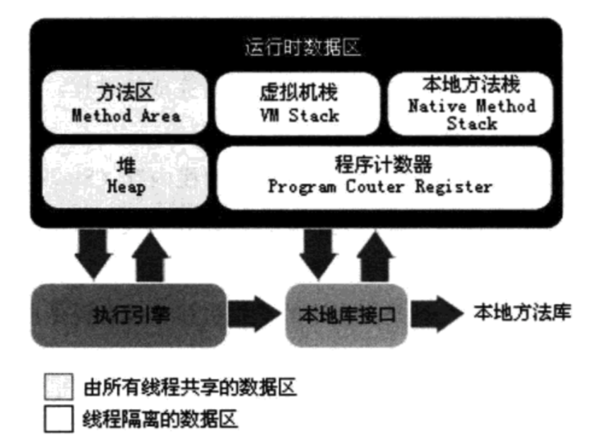

# Java虚拟机

| tag  | author     | date       | history    |
| ---- | ---------- | ---------- | ---------- |
| Java | caizhenghe | 2018-03-18 | create doc |

[TOC]

## 内存结构

Java虚拟机的内存结构分为5个部分：程序计数器、虚拟机栈、本地方法栈、方法区、堆。其中程序计数器、虚拟机栈、本地方法栈是线程私有的；方法区和堆是线程共享的。结构图如下：

### 程序计数器

是当前线程所执行的**字节码的行号指示器**，每条线程都要有一个独立的程序计数器，这类内存也称为“线程私有”的内存。

正在执行java方法的话，计数器记录的是**虚拟机字节码指令的地址（当前指令的地址）**。如果是**Native方法，则为空**。

这个内存区域是唯一一个在虚拟机中**没有规定任何OutOfMemoryError情况的区域**。

### 虚拟机栈

也是线程私有的。

每个方法在执行的时候会创建一个栈帧，存储了**局部变量表，操作数栈，动态连接，方法返回地址**等。

每个方法从调用到执行完毕，对应一个栈帧在虚拟机栈中的入栈和出栈。

通常所说的栈，一般是指虚拟机栈中的局部变量表部分。

局部变量表所需的内存在**编译期间**完成分配。

如果线程请求的栈深度大于虚拟机所允许的深度，则StackOverflowError。

如果虚拟机栈可以动态扩展，扩展到无法申请足够的内存，则OutOfMemoryError。

> Tips：局部变量表存放了编辑期可知的各种基本数据类型（boolean、byte、char、short、int、long、double、float）、对象引用（reference）类型和returnAddress类型（指向了一条字节码指令的地址）。
>
> Notice：类变量（对象引用）属于类的一部分，和类对象一起存储在堆中，而并非虚拟机栈中。

### 本地方法栈

线程私有，和虚拟机栈类似，主要为虚拟机使用到的Native方法服务。

也会抛出StackOverflowError和OutOfMemoryError。

### 方法区

被所有线程共享的一块内存区域。

用于存储已被虚拟机加载的类信息，常量，静态变量、即时编译器编译后的代码等。

除了和Java堆一样不需要连续的内存和可以选择固定大小或者可扩展外，还可以选择不实现垃圾收集。这个区域的内存回收目标主要针对常量池的回收和对类型的卸载。

当方法区无法满足内存分配需求时，则抛出OutOfMemoryError异常。

在HotSpot虚拟机中，用永久代来实现方法区，将GC分代收集扩展至方法区，但是这样容易遇到内存溢出的问题。

**JDK1.7中，已经把放在永久代的字符串常量池移到堆中。**

**JDK1.8撤销永久代，引入元空间。**

#### 运行时常量池

它是方法区的一部分。class文件中除了有关的版本、字段、方法、接口等描述信息外、还有一项信息是常量池，用于存放编辑期生成的各种字面量和符号引用，这部分内容将在类加载后进入方法区的运行时常量池中存放。 

Java语言并不要求常量一定只有编辑期才能产生，也就是可能将新的常量放入池中，这种特性被开发人员利用得比较多是便是String类的intern（）方法。 

当常量池无法再申请到内存时会抛出OutOfMemoryError异常。

### 堆

堆是Java虚拟机所管理的内存中最大的一块。Java堆是被所有线程共享的一块内存区域，在虚拟机启动的时候创建，此内存区域的唯一目的是存放对象实例，几乎所有的对象实例都在这里分配内存。所有的对象实例和数组都在堆上分配。 

Java堆是垃圾收集器管理的主要区域。Java堆细分为新生代和老年代。不管怎样，划分的目的都是为了更好的回收内存，或者更快的分配内存。 

Java堆可以处于物理上不连续的内存空间中，只要逻辑上连续是连续的即可。若在堆中没有完成实例分配，并且堆也无法再扩展时，将会抛出OutOfMemoryError异常。