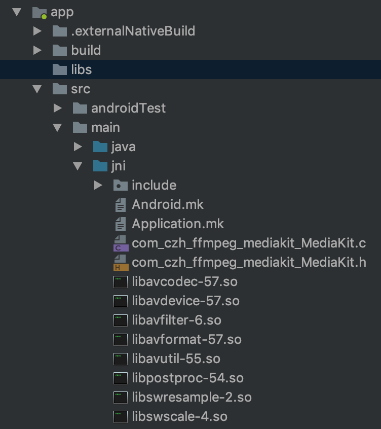

# FFmpeg_Android移动端项目构建指南（MacOs）

## 概要

搭建一个集成ffmpeg的Android工程，通常包含以下流程：

1. 下载安装ndk，配置环境变量。
2. 下载ffmpeg源码，编译生成ffmpeg的so动态库。
3. 编写java层代码，声明native接口。
4. 编写jni/c层代码，调用ffmpeg相关接口。
5. 编写Android.mk、Application.mk，用于编译项目的jni/c层代码，生成工程的so动态库。
6. 配置app下的build.gradle，使项目能够编译成功。

下面针对**macosx**平台进行详细描述：

## 配置NDK

Ndk各版本下载地址：https://blog.csdn.net/shuzfan/article/details/52690554

我下载的是ndk_r14b，下载完成后在~/.bash_profile文件中配置环境变量：

```sh
export NDK_ROOT=/Users/caizhenghe/SrcLib/android-ndk-r14b
export PATH=$PATH:$NDK_ROOT
```

配置好后，在终端命令行中输入以下命令使环境变量生效：

```shell
// 使环境变量生效
source ~/.bash_profile
// 验证环境变量配置成功（有时需要重启终端命令行窗口才能看到最新配置）
$PATH
// 验证ndk配置成功（进入ndk_r10e/samples/hello-jni文件夹，输入以下命令）
ndk-build
```

## 编译ffmpeg

ffmpeg历史版本地址：https://git.ffmpeg.org/gitweb/ffmpeg.git/tags

我下载的是3.3.7（建议下载3.3.x版本，最新版本编译问题较多）。下载好后，首先修改config文件：

```sh
# 找到这四行
SLIBNAME_WITH_MAJOR='$(SLIBNAME).$(LIBMAJOR)'
LIB_INSTALL_EXTRA_CMD='$$(RANLIB)"$(LIBDIR)/$(LIBNAME)"'
SLIB_INSTALL_NAME='$(SLIBNAME_WITH_VERSION)'
SLIB_INSTALL_LINKS='$(SLIBNAME_WITH_MAJOR)$(SLIBNAME)'

# 替换成下面这四行
SLIBNAME_WITH_MAJOR='$(SLIBPREF)$(FULLNAME)-$(LIBMAJOR)$(SLIBSUF)'
LIB_INSTALL_EXTRA_CMD='$$(RANLIB)"$(LIBDIR)/$(LIBNAME)"'
SLIB_INSTALL_NAME='$(SLIBNAME_WITH_MAJOR)'
SLIB_INSTALL_LINKS='$(SLIBNAME)'
```

编写编译脚本build_android.sh，给一个网上用例：https://blog.csdn.net/codeteenager/article/details/81038575。

将前四行修改成自己的配置路径：

```sh
export TMPDIR=/Users/caizhenghe/SrcLib/ffmpeg-3.3.7/
export NDK=/Users/caizhenghe/SrcLib/android-ndk-r14b
export SYSROOT=$NDK/platforms/android-21/arch-arm/
export TOOLCHAIN=$NDK/toolchains/arm-linux-androideabi-4.9/prebuilt/darwin-x86_64
```

 在ffmpeg根目录下，执行终端命令：./build_andorid.sh

编译完成后，生成好的动态库和头文件放在如下路径：ffmpeg/android/arm/

## Java层代码

在java文件中定义native方法，并且在同文件中静态加载so库：

```java
// 该代码块在运行时执行 ，加载ffmpeg和工程的so库，类库的命名规则是：libXXX.so -> XXX
static {
        System.loadLibrary("avcodec-57");
        System.loadLibrary("avdevice-57");
        System.loadLibrary("avfilter-6");
        System.loadLibrary("avformat-57");
        System.loadLibrary("avutil-55");
        System.loadLibrary("postproc-54");
        System.loadLibrary("swresample-2");
        System.loadLibrary("swscale-4");
        System.loadLibrary("mediakit");
}
```


## JNI层代码

在写JNI层代码之前需要先将so库和头文件导入工程jni目录下，目录结构如下：



直接使用javah工具生成JNI头文件，再新建c文件，定义同名方法，在该方法中调用avcodec的接口，源文件代码如下：

> javah工具的创建和使用步骤参见该链接：[javah使用说明](../android/JNI.md)

```c
#include "libavcodec/avcodec.h"
#include "com_czh_ffmpeg_mediakit_MediaKit.h"

jstring Java_com_czh_ffmpeg_mediakit_MediaKit_getAvcodecConfigurationNative
  (JNIEnv *env, jobject thiz)
  {
        char info[10000] = { 0 };
        sprintf(info, "%s\n", avcodec_configuration());
        return (*env)->NewStringUTF(env, info);
  }
```

值得注意的是，上述源文件是c文件，(*env)是指针类型，并且需要传上下文对象到NewStringUTF方法中。

如果将源文件改成cpp文件，则会编译出错：**undefined reference to 'avcodec_configuration()'**

原因是当工程中有cpp文件时，编译器会默认使用c++的方式编译头文件函数(.h->.s->.o)，由于c++支持重载，编译器会将函数参数加入函数名后（func_1_2），而链接器又会使用c的规则匹配库文件中的函数（func_）和目标文件（.o）中的函数（func_1_2），当链接器找不到库文件函数对应的函数定义时就会报undefined reference错误。

解决方案是使用**extern "C"**包裹头文件的函数（**包括第三方库的头文件**），告诉编译器以c的方式编译函数。头文件代码如下：

```c
/* DO NOT EDIT THIS FILE - it is machine generated */
#include <jni.h>
/* Header for class com_czh_ffmpeg_mediakit_MediaKit */

#ifndef _Included_com_czh_ffmpeg_mediakit_MediaKit
#define _Included_com_czh_ffmpeg_mediakit_MediaKit
#ifdef __cplusplus
extern "C" {
#endif
/*
 * Class:     com_czh_ffmpeg_mediakit_MediaKit
 * Method:    getAvcodecConfigurationNative
 * Signature: ()Ljava/lang/String;
 */
JNIEXPORT jstring JNICALL Java_com_czh_ffmpeg_mediakit_MediaKit_getAvcodecConfigurationNative
  (JNIEnv *, jobject);

#ifdef __cplusplus
}
#endif
#endif

```

cpp文件代码如下：

```c
#include "com_czh_ffmpeg_mediakit_MediaKit.h"
/* Notice：第三方库的头文件也需要包裹 */
#ifdef __cplusplus
extern "C" {
#endif
#include "libavcodec/avcodec.h"
#ifdef __cplusplus
}
#endif

jstring Java_com_czh_ffmpeg_mediakit_MediaKit_getAvcodecConfigurationNative
  (JNIEnv *env, jobject thiz)
  {
        char info[10000] = { 0 };
        sprintf(info, "%s\n", avcodec_configuration());
        return env->NewStringUTF(info);
  }
```

cpp文件中调用函数的方式会与c有些不同，env本身就是指针，且不需要传上下文对象。

## 编写Android.mk

需要在**编译期**将JNI代码编成so库，Android.mk代码如下：

```makefile
LOCAL_PATH := $(call my-dir)

# FFmpeg library
include $(CLEAR_VARS)
LOCAL_MODULE := avcodec
LOCAL_SRC_FILES := libavcodec-57.so
include $(PREBUILT_SHARED_LIBRARY)

include $(CLEAR_VARS)
LOCAL_MODULE := avdevice
LOCAL_SRC_FILES := libavdevice-57.so
include $(PREBUILT_SHARED_LIBRARY)

include $(CLEAR_VARS)
LOCAL_MODULE := avfilter
LOCAL_SRC_FILES := libavfilter-6.so
include $(PREBUILT_SHARED_LIBRARY)

include $(CLEAR_VARS)
LOCAL_MODULE := avformat
LOCAL_SRC_FILES := libavformat-57.so
include $(PREBUILT_SHARED_LIBRARY)

include $(CLEAR_VARS)
LOCAL_MODULE := avutil
LOCAL_SRC_FILES := libavutil-55.so
include $(PREBUILT_SHARED_LIBRARY)

include $(CLEAR_VARS)
LOCAL_MODULE := postproc
LOCAL_SRC_FILES := libpostproc-54.so
include $(PREBUILT_SHARED_LIBRARY)

include $(CLEAR_VARS)
LOCAL_MODULE := swresample
LOCAL_SRC_FILES := libswresample-2.so
include $(PREBUILT_SHARED_LIBRARY)

include $(CLEAR_VARS)
LOCAL_MODULE := swscale
LOCAL_SRC_FILES := libswscale-4.so
include $(PREBUILT_SHARED_LIBRARY)

# Program
include $(CLEAR_VARS)
LOCAL_MODULE := mediakit
LOCAL_SRC_FILES := com_czh_ffmpeg_mediakit_MediaKit.cpp
LOCAL_C_INCLUDES += $(LOCAL_PATH)/include
LOCAL_LDLIBS := -llog -lz
LOCAL_SHARED_LIBRARIES := avcodec avdevice avfilter avformat avutil postproc swresample swscale
include $(BUILD_SHARED_LIBRARY)

```

需要注意的是，每个预编译的so库都只能单独加载，不能把所有so库合并成一个模块。

另外，在编译工程so库时不需要借助工程头文件。

## 编写Application.mk

Application.mk通常只写一行代码：APP_ABI := armeabi

用于指定生成哪些平台的工程库文件。若写all则同时生成armeabi和x86两个平台的工程库文件。由于之前编译的ffmpeg库文件是armeabi平台的，因此只生成armeabi平台的工程库文件即可。

## 配置Gradle

实现了上述几步后，还会碰到一些编译问题，需要在app的build.gradle文件中进行相应配置：

1. 通知IDE使用Android.mk编译JNI层代码。
2. 添加限制，说明工程库文件只支持armeabi平台。若不添加说明，在x86架构的安卓手机上会编译失败；若添加了说明，IDE会提示无法安装。
3. 工程库文件默认生成在：build/intermediates/ndkBuild/debug/obj/local/armeabi目录下，可以指定生成在libs文件夹下。

```groovy
android {
    compileSdkVersion 27
    defaultConfig {
        // 限制工程库文件只支持armeabi平台。
        ndk {
            abiFilters 'armeabi'
        }
    }
    // 指定使用Android.mk来编译生成工程库文件
    externalNativeBuild {
        ndkBuild {
            path 'src/main/jni/Android.mk'
        }
    }
    // 指定库文件的生成目录
    sourceSets {
        main {
            jniLibs.srcDirs = ['libs']
        }
    }
}
```

