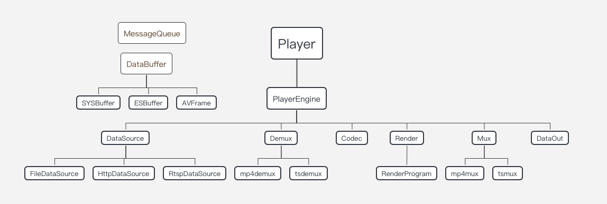

# MPEGTS文件格式

| 版本/状态 | 责任人 | 起止日期   | 备注     |
| --------- | ------ | ---------- | -------- |
| v0.1/草稿 | 蔡政和 | 2019/06/25 | 创建文档 |

[TOC]

## 1.背景介绍

该文档提供对MPEGTS文件格式的介绍，方便对mux和demux原理的理解。本文档大部分内容来自于ISO_IEC_13818-1标准文档，若有描述不清楚的地方，可查阅标准文档。

### 1.1.播放流程介绍

TS流从传输到渲染（播放）通常会经历以下步骤：

Demux->Decode->AVSync->Render

TS流从传输到本地文件（录像）通常会经历以下步骤：

Demux->Mux（如果不需要从H264/H265中获取PTS等信息，也可以直接将TS流存储到本地）

### 1.2.播放器大致框架

根据上面描述的流程，通常一个播放器会划分为以下几个模块：

## 2.MPEGTS格式

MPEG（Moving Picture Experts Group）可以理解为一种标准，TS（Transport Stream）是一种用于传输音视频的容器。TS最常用的场景是用于广播，如实时电视节目，是永远无法知道什么时候会有客户端进行数据的请求，其必备的一个特性就是：从任意一点接入获取数据，都能保证在较短时间内能播放成功。因此，TS格式常用于直播的数据流传输，HTTP Live Streaming（HLS）就是基于TS的一种直播协议。

### 2.1.术语介绍

### 2.2.MPEGTS基本单元

#### 2.2.1.Adaptation field

### 2.3.关键的PACKET

#### 2.3.1.PAT/PMT

#### 2.3.2.PES

