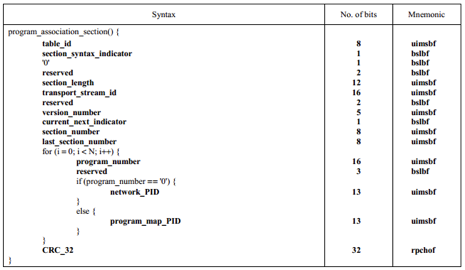

# MPEGTS文件格式

| 版本/状态 | 责任人 | 起止日期   | 备注     |
| --------- | ------ | ---------- | -------- |
| v0.1/草稿 | 蔡政和 | 2019/06/25 | 创建文档 |

[TOC]

## 1.背景介绍

该文档提供对MPEGTS文件格式的介绍，方便理解mux和demux的原理。本文档大部分内容来自于ISO_IEC_13818-1标准文档，若有描述不清楚的地方，可查阅标准文档。

### 1.1.MPEG

MPEG全称`Moving Picture Experts Group`，中文翻译是`动态图像专家组`，泛指由该小组制定的一系列视频编码标准。至今已制定了MPEG-1、MPEG-2、MPEG-3、MPEG-4、MPEG-7等多个标准。

压缩原理：

- 空间冗余：空间像素之间的相关性，例如对于平坦的区域，其像素值与邻近点相同或接近：`DCT->Quantization->Zigzag->Entropy Coding`。
-  时间冗余：相邻帧之间类似（尤其在静态时或静止的背景）：`I、P、B` 。

### 1.2.TS

MPEG-2系统标准定义了两种方法来复用音频、视频和其他数据到一个适合于传输和存储的格式。

- PS：为很少出现差错的应用而设计。比如DVD和SVCD。
- TS：为较容易出现数据丢失的应用而设计，采用188Byte的固定大小包。

TS（Transport Stream）是一种用于传输音视频的容器。最常见的场景是用于广播，如实时电视节目，是永远无法知道什么时候会有客户端进行数据的请求，其必备的一个特性就是：从任意一点接入获取数据，都能保证在较短时间内能播放成功。因此，TS格式常用于直播的数据流传输，HTTP Live Streaming（HLS）就是基于TS的一种直播协议。

## 2.MPEGTS格式

### 2.1.术语介绍

- ES：Elementary Stream，只包含一种数据的基本数据流，如音频流、视频流等
- Packet：TS中的基本单元，188 byte
- PES：Packetized Elementary Stream，装载ES的packet
- Program：节目，可用一个电视节目来理解，TS中允许携带多个program
- PID：Packet identifier，用于识别TS中的program以及program中的ES，一个TS中所有的PID不会重复，PID的取值表如图1
- PMT：Program Map Table，包含一个program的信息，如该program包含多少个ES
- PAT：Program Association Table，列出TS中所包含的program的数量
- STC：System Time Clock，系统时序时钟
- PCR：Program Clock Reference，节目时钟参考
- PTS：Presentation Time-Stamp，显示时间戳
- DTS：Decode Time-Stamp，解码时间戳

注：TS中的时间单位统一为90000，后续章节中提及的duration和time-stamp，如无特殊说明，都是以90000为时间单位。

### 2.2.MPEGTS基本单元

TS的基本数据单元称之为packet，而TS就是由一系列的packet组成。Packet长度固定为188 byte，并且以0x47作为header。 Packet可以携带多种信息，包括音频、视频数据和节目表等，详见ISO_IEC_13818-1 2.4.3.2节。Packet的格式如下图：

重要字段说明：

- sync_byte：值为0x47

- payload_unit_start_indicator：标明是否携带PES packet（后续章节描述），可理解为是否为新的一帧数据的开始packet。

- adaptation_field_control：因为每个TS packet固定长度为188 byte，若出现数据没法塞满188 byte时，会使用冗余数据进行填充。该字段占2 bit，取值已意义如下图：

  

- continuity_counter：用于表示同一个PID的所有packet的序列号，占4 bit，每增加一个packet值加1，值在0~15 循环。可用于TS流中的错误检测。当adaptation field control值为’00’或者’10’时，continuity counter不应该增加。

#### 2.2.1.Adaptation field

若adaptation_field_control的值为’10’或者’11’时，packet中会携带adaptation field，adaptation field除了作为冗余数据进行填充之外，还有一个很重要的功能是可以携带PCR信息（Program Clock Reference），Adaptation field的结构详见ISO_IEC_13818-1 Table 2-6。

### 2.3.关键的PACKET

由于TS中每个packet的header部分规则一致，如2.2节描述，后续讲述其他packet时只描述packet中的data部分。

#### 2.3.1.PAT

前文提到TS是可以随时接入的，这就要求TS中必须间隔一定距离就会有携带节目信息的packets，而这些packets就是PAT packet和PMT packet。

PAT packet的PID固定为0x0000，会罗列TS中所有的program信息，包括每个program对应PMT的PID。PAT的结构如图4，详情可参考ISO_IEC_13818-1 2.4.4.3节的Table 2-25。

重要字段说明：

- table_id：值为0x00
- section_length：起始2 bit为’00’，剩余的10 bit代表的是从transport_stream_id从CRC_32的长度。用这个值减去9（transport_stream_id到last_section_number的长度）和4（CRC_32长度），得到的值再除以4（循环体内的内容长度），得到的就是PAT中携带的program数量。

#### 2.3.2.PMT

PMT packet的PID在PAT中定义，每个program都会对应一个PMT。PMT罗列了该program所包含的ES以及ES的类型信息（stream type）。PMT的结构如图5，详情可参考ISO_IEC_13818-1 2.4.4.8节的Table 2-28。

重要字段说明：

- table_id：值为0x02
- PCR_PID：声明该program携带PCR信息的PID
- stream_type：ES 的数据类型，详见图6
- elementary_PID：ES 的PID

另外补充两个常用的stream type：

- 0x1b：H.264 video
- 0x24：HEVC video

#### 2.3.3.PES

PES packet是用于承载ES的数据的一种packet，对于音频和视频数据，ES数据是以帧为单位的。2.2节提及到若payload_unit_start_indicator字段为’1’时，代表的是新的一帧数据的开始，于此同时，packet中会携带有PES header，用于说明这帧数据的信息，包含如数据帧长度，PTS/DTS等与播放相关的信息，header结构详见ISO_IEC_13818-1 2.4.3.7节的Table 2-17。

## 